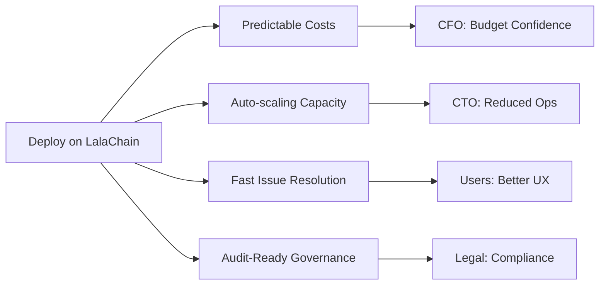

# Why LalaChain for Business

**LalaChain offers enterprises a blockchain that manages itself — reducing operational overhead, ensuring predictable costs, and adapting to demand without manual intervention.**

---

## The Business Problem

Traditional blockchains present challenges for enterprise adoption:

| Problem | Impact on Business |
|---------|-------------------|
| Unpredictable fees | Can't budget transaction costs accurately |
| Slow governance | Parameter changes take weeks/months |
| Manual scaling | Requires engineering intervention for demand changes |
| Governance politics | Changes blocked by competing interests |
| Downtime risk | Poor parameter choices can degrade performance |

---

## How LalaChain Solves This

### 1. Predictable Costs

The AI Advisor keeps fees within a defined band (800M–5B ulala/gas). When fees spike, the system automatically proposes corrections — typically within minutes, not months.

**Business benefit:** You can model transaction costs with confidence.

### 2. Self-Optimizing Infrastructure

The chain monitors its own performance and adjusts:
- Block capacity (gas limit) scales with demand
- Fees adjust to maintain accessibility
- No need to petition governance committees

**Business benefit:** Reduced operational overhead. The chain adapts to your usage patterns.

### 3. Fast Governance

Parameter changes can be proposed, voted on, and activated in ~200 seconds (4 epochs). Compare to Ethereum (6-18 months) or Cosmos Hub (weeks).

**Business benefit:** Issues are resolved quickly. Your users don't suffer while waiting for bureaucracy.

### 4. Transparent Decision-Making

Every AI proposal includes:
- The data that triggered it
- The rule that was applied
- The expected outcome
- Full voting record

**Business benefit:** Auditable governance for compliance requirements.

### 5. Human Oversight Maintained

Despite automation, validators must approve every change. The AI cannot act unilaterally.

**Business benefit:** Regulatory-friendly model. Humans are always in the loop.

---

## Enterprise Value Proposition

---

## Who Should Use LalaChain?

| Organization Type | Use Case | Why LalaChain |
|------------------|----------|---------------|
| **Fintech startups** | Payment rails, tokenized assets | Predictable fees, fast finality |
| **Enterprise supply chain** | Track-and-trace, provenance | Self-managing, low maintenance |
| **Gaming studios** | In-game economies, NFTs | Handles bursty traffic gracefully |
| **Government/Public sector** | Digital identity, records | Transparent governance, auditable |
| **DeFi protocols** | Lending, DEX, stablecoins | Fee stability prevents liquidation cascades |

---

## Total Cost of Ownership

### LalaChain vs. Traditional Blockchain Deployment

| Cost Factor | Traditional Chain | LalaChain |
|-------------|-------------------|-----------|
| Node operation | Same | Same |
| Governance overhead | High (proposals, lobbying, voting) | Low (AI proposes, validators vote) |
| Fee monitoring | Manual (alert systems) | Built-in (AI monitors continuously) |
| Capacity planning | Manual (estimate, propose, wait) | Automatic (AI adjusts per epoch) |
| Incident response | Slow (detect → propose → vote → apply) | Fast (~200 seconds end-to-end) |
| **Total operational cost** | **Higher** | **Lower** |

---

## Getting Started for Enterprises

1. **Evaluate** — Run a testnet node, explore the dashboard
2. **Integrate** — Connect via REST API (standard Cosmos SDK endpoints)
3. **Deploy** — Launch on testnet, then mainnet
4. **Operate** — Monitor via dashboard, participate in governance if running a validator

See [Integration Guide](integration-guide.md) for technical details.

---

**Next:** [Use Cases](use-cases.md)
