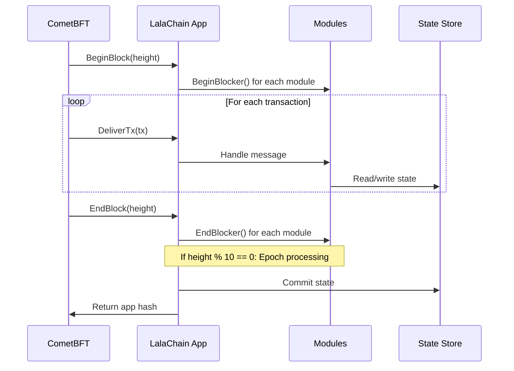

# Architecture Deep Dive

**A detailed look at LalaChain's internal architecture for developers building on or contributing to the protocol.**

---

## Module Architecture

LalaChain follows Cosmos SDK's module pattern where each module is responsible for a specific domain:

```mermaid
flowchart TD
    subgraph "App (prototype.go)"
        MM[Module Manager]
    end
    
    subgraph "Custom Modules"
        TEL[x/telemetry<br/>Keeper + Store]
        AI[x/aiadvisor<br/>Keeper + Store]
        GOV[x/gov<br/>Keeper + Store]
    end
    
    subgraph "SDK Modules"
        AUTH[x/auth]
        BANK[x/bank]
        STAKING[x/staking]
        DIST[x/distribution]
    end
    
    subgraph "Infrastructure"
        KV[KV Store (IAVL Tree)]
        CMT[CometBFT]
    end
    
    MM --> TEL
    MM --> AI
    MM --> GOV
    MM --> AUTH
    MM --> BANK
    
    TEL --> KV
    AI --> KV
    GOV --> KV
    CMT --> MM
```

---

## Keeper Pattern

Each module has a **Keeper** — the primary interface for reading and writing module state:

```go
type TelemetryKeeper struct {
    kpis     []EpochKPI
    // Per-block accumulators
    blocks   []BlockMetrics
}

type AIAdvisorKeeper struct {
    lowStreak      int
    highStreak     int
    config         AdvisorConfig
    proposals      []Proposal
}

type LalaGovKeeper struct {
    activeProposals  []Proposal
    resolvedHistory  []Proposal
    config           GovConfig
}
```

### Keeper Responsibilities
- **Read state** — Query current module data
- **Write state** — Update state during block processing
- **Validate** — Ensure state transitions are valid
- **Expose API** — Provide endpoints for external queries

---

## Block Lifecycle



---

## Epoch Processing (EndBlocker)

The epoch system runs in the EndBlocker at every 10th block:

```go
func runEpochEndBlocker(ctx context.Context) {
    // 1. Compute KPIs from accumulated block data
    kpi := telemetryKeeper.ComputeEpochKPI()
    
    // 2. Feed KPIs to AI Advisor
    proposal := aiAdvisorKeeper.Evaluate(kpi)
    
    // 3. If proposal generated, submit to governance
    if proposal != nil {
        govKeeper.SubmitProposal(proposal)
    }
    
    // 4. Process governance (tally votes, activate changes)
    govKeeper.ProcessEpoch()
    
    // 5. Apply EIP-1559 fee decay
    applyFeeDecay()
    
    // 6. Persist state
    aiAdvisorKeeper.SaveState()
    govKeeper.SaveState()
}
```

---

## State Persistence

Modules use Cosmos SDK's KV store (backed by IAVL Merkle tree):

```go
// SaveState serializes module state to the KV store
func (k *AIAdvisorKeeper) SaveState() {
    data, _ := json.Marshal(k)
    store.Set([]byte("aiadvisor_state"), data)
}

// LoadState deserializes module state from the KV store
func (k *AIAdvisorKeeper) LoadState() {
    data := store.Get([]byte("aiadvisor_state"))
    json.Unmarshal(data, k)
}
```

State is committed with each block and included in the Merkle root (app hash), ensuring all validators agree on the same state.

---

## REST API Registration

Custom endpoints are registered in the app setup:

```go
func registerRESTRoutes(router *mux.Router) {
    router.HandleFunc("/lala/telemetry/v1/kpis", handleKPIs).Methods("GET")
    router.HandleFunc("/lala/aiadvisor/v1/state", handleAIState).Methods("GET")
    router.HandleFunc("/lala/lalagov/v1/history", handleGovHistory).Methods("GET")
    router.HandleFunc("/lala/lalagov/v1/config", handleGovConfig).Methods("GET")
}
```

---

## Configuration System

Module configurations are defined in code with governance-adjustable parameters:

```go
type AdvisorConfig struct {
    MinFeeTarget       int64   `json:"min_fee_target"`       // 800_000_000
    MaxFeeTarget       int64   `json:"max_fee_target"`       // 5_000_000_000
    LowUtilThreshold   float64 `json:"low_util_threshold"`   // 0.40
    HighUtilThreshold  float64 `json:"high_util_threshold"`  // 0.80
    LowStreakRequired  int     `json:"low_streak_required"`  // 3
    HighStreakRequired int     `json:"high_streak_required"` // 2
}

type GovConfig struct {
    Quorum          float64 `json:"quorum"`           // 0.66
    Threshold       float64 `json:"threshold"`        // 0.51
    VotingPeriod    int     `json:"voting_period"`    // 1 (epochs)
    ActivationDelay int     `json:"activation_delay"` // 2 (epochs)
}
```

---

## Testing

```bash
# Run unit tests
cd chain
go test ./...

# Run specific module tests
go test ./x/aiadvisor/
go test ./x/gov/
go test ./x/telemetry/
```

---

## Key Design Decisions

| Decision | Why |
|----------|-----|
| In-process CometBFT | Simpler deployment, single binary |
| JSON state serialization | Human-readable, debuggable |
| Epoch-based processing | Reduces noise, batches governance |
| Deterministic rules | Consensus-safe, auditable |
| Hard parameter bounds | Safety against runaway AI proposals |

---

**Next:** [REST API Reference](rest-api-reference.md)
