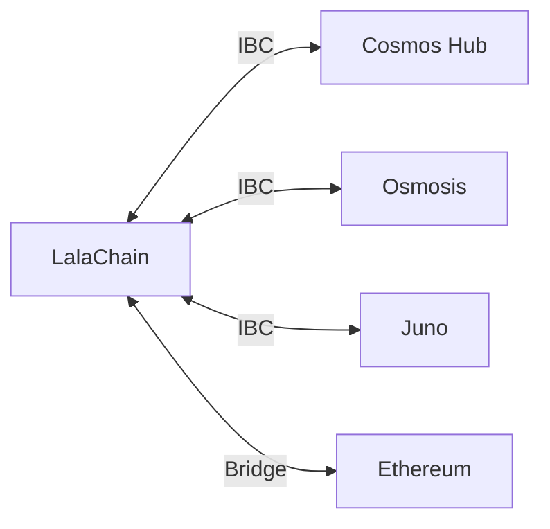

# Applications

**LalaChain supports a range of applications from DeFi to supply chain, all benefiting from self-optimizing network parameters.**

---

## Application Categories

### 1. DeFi (Decentralized Finance)

LalaChain's dynamic fee model makes it particularly suitable for DeFi applications where predictable costs matter:

- **DEX (Decentralized Exchange)** — Token swaps with fees that auto-adjust to demand
- **Lending/Borrowing** — Collateralized lending with on-chain liquidation
- **Stablecoins** — Pegged assets with algorithmic or collateral-backed stability
- **Yield aggregators** — Auto-compounding staking and LP rewards

**Why LalaChain?** DeFi users are fee-sensitive. LalaChain's AI-managed fees prevent the fee spikes that make DeFi unusable on other chains during peak demand.

---

### 2. Supply Chain & Provenance

Track goods from origin to consumer with immutable records:

- **Food traceability** — Farm-to-table tracking
- **Luxury goods authentication** — Prove authenticity of high-value items
- **Carbon credits** — Track and verify carbon offset claims
- **Pharmaceutical supply chain** — Ensure drug authenticity and cold chain compliance

**Why LalaChain?** Supply chain apps need consistent, low-cost transactions. AI-managed parameters ensure the chain stays affordable even during business-hour transaction spikes.

---

### 3. Gaming & NFTs

Digital ownership and in-game economies:

- **NFT marketplaces** — Buy, sell, trade digital collectibles
- **Play-to-earn** — Games with real token rewards
- **In-game assets** — Cross-game interoperable items
- **Metaverse land** — Virtual real estate on-chain

**Why LalaChain?** Games generate bursty traffic. The AI Advisor can detect gaming-related traffic patterns and adjust gas limits to accommodate spikes without degrading performance for other users.

---

### 4. Identity & Credentials

Self-sovereign identity solutions:

- **Decentralized Identity (DID)** — User-controlled identity documents
- **Verifiable credentials** — Academic degrees, certifications, licenses
- **KYC compliance** — Prove identity without revealing raw data
- **Reputation systems** — On-chain reputation scores

---

### 5. Governance Tools

Tools that leverage LalaChain's native governance capabilities:

- **DAO frameworks** — Organizations governed by token holders
- **Treasury management** — Multi-sig controlled funds
- **Proposal dashboards** — Visualize and track governance activity
- **Delegation markets** — Liquid democracy platforms

---

## Cross-Chain Applications (IBC)

LalaChain is built on Cosmos SDK, which means it's **IBC-compatible** (Inter-Blockchain Communication). This enables:

- Token transfers to/from other Cosmos chains
- Cross-chain contract calls
- Shared liquidity with Osmosis, Cosmos Hub, etc.
- Bridge assets from Ethereum and other ecosystems

---

## Building on LalaChain

Developers can build applications using:

| Approach | Best For | Language |
|----------|----------|---------|
| REST API integration | Web/mobile apps, dashboards | Any |
| CosmWasm smart contracts | DeFi, NFTs, complex logic | Rust |
| Custom SDK modules | Core protocol extensions | Go |
| IBC applications | Cross-chain interactions | Go/Rust |

See the [Developer Quickstart](../developers/quickstart.md) to begin building.
