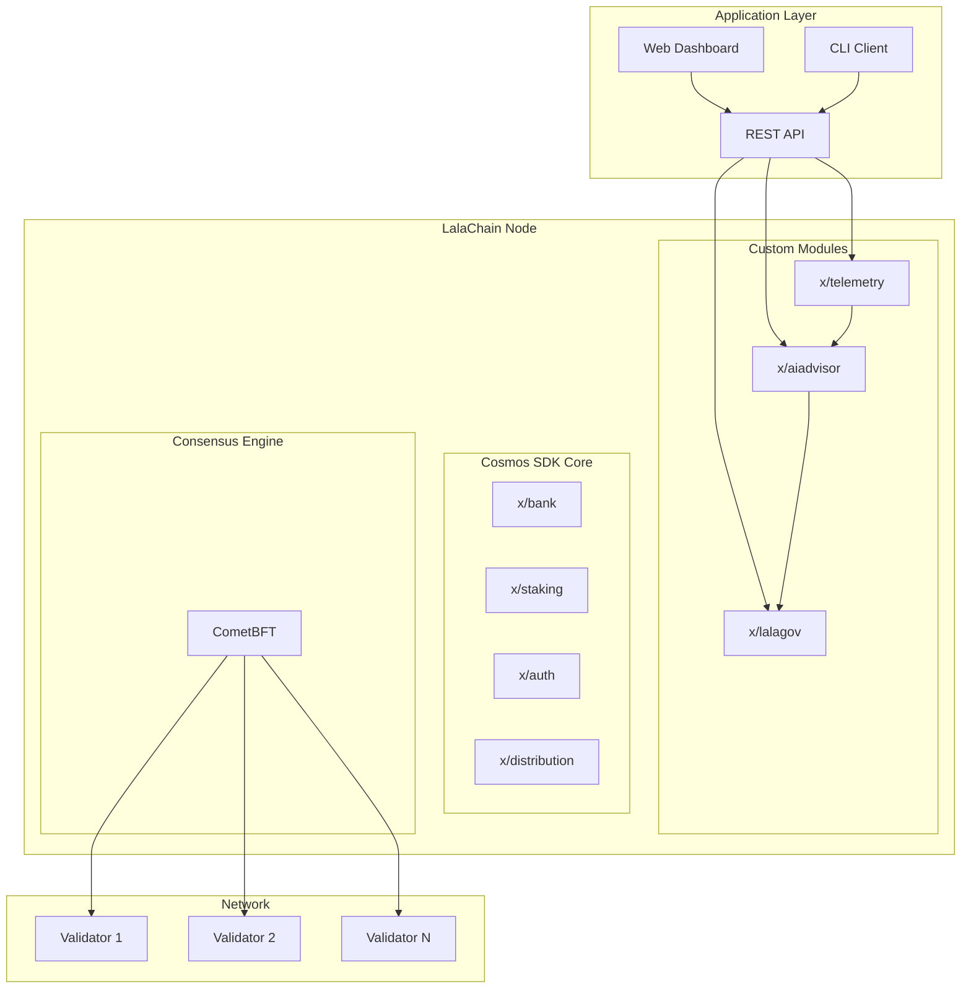
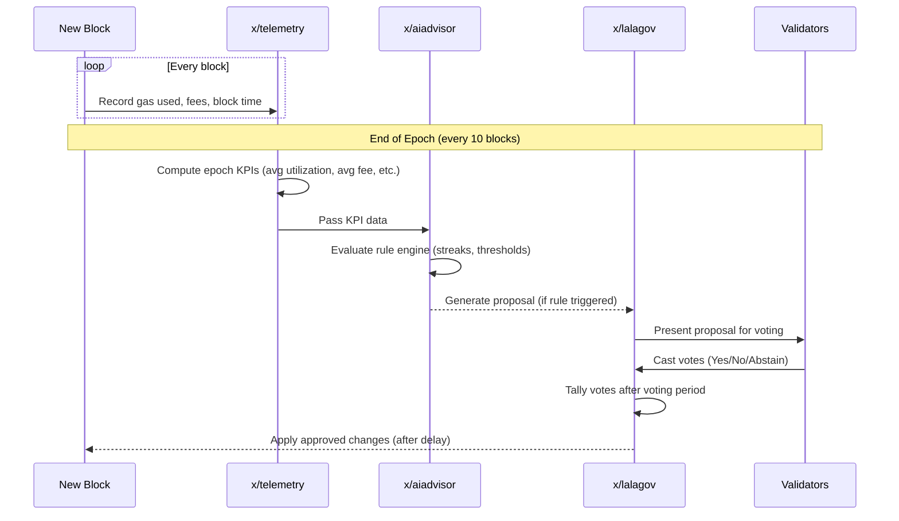

# Architecture Overview

**LalaChain is a modular Layer 1 blockchain built on Cosmos SDK with three custom modules that enable AI-driven governance.**

---

## High-Level Architecture

---

## Layer Breakdown

### 1. Consensus Layer (CometBFT)

The foundation. CometBFT handles:
- Peer-to-peer networking between validators
- Block proposal and voting (Byzantine Fault Tolerant)
- Transaction mempool management
- Finality guarantees (no chain reorganizations)

**Protocol:** BFT consensus requiring 2/3+ validator agreement  
**Block time:** ~5 seconds  
**Finality:** Instant (single-slot finality)

### 2. Application Layer (Cosmos SDK)

The SDK provides standard blockchain functionality through modules:

| Module | Purpose |
|--------|---------|
| `x/auth` | Account management, transaction authentication |
| `x/bank` | Token transfers, balance tracking |
| `x/staking` | Validator set management, delegation |
| `x/distribution` | Reward distribution to validators/delegators |
| `x/gov` | (Base) governance infrastructure |

### 3. LalaChain Custom Layer

Three modules that provide the unique AI governance functionality:

| Module | Purpose | Runs Every |
|--------|---------|-----------|
| `x/telemetry` | Collects block metrics, computes KPIs | Every epoch (10 blocks) |
| `x/aiadvisor` | Evaluates KPIs against rules, generates proposals | Every epoch |
| `x/lalagov` | Manages proposal lifecycle, voting, activation | Every epoch |

---

## Data Flow

---

## Module Interactions

### x/telemetry → x/aiadvisor
- Passes computed KPIs at epoch end
- KPIs include: avg_block_utilization, avg_base_fee, avg_block_time, tx_count

### x/aiadvisor → x/lalagov
- Generates signed proposals when rules trigger
- Each proposal specifies: parameter to change, direction, magnitude, rationale

### x/lalagov → Chain State
- Applies approved parameter changes to the chain configuration
- Tracks proposal history for transparency

---

## State Storage

Each module maintains its own state in the application's key-value store:

| Module | State Contents |
|--------|---------------|
| `x/telemetry` | KPI history (per epoch), raw block metrics |
| `x/aiadvisor` | Rule configuration, streak counters, proposal log |
| `x/lalagov` | Active proposals, vote tallies, resolved proposals, config |

State is persisted via the Cosmos SDK `KVStore` and included in the app hash (Merkle root) committed with each block.

---

## API Layer

LalaChain exposes a REST API for external access:

| Endpoint | Returns |
|----------|---------|
| `GET /lala/telemetry/v1/kpis` | Historical KPI data |
| `GET /lala/aiadvisor/v1/state` | AI rule configuration and streak state |
| `GET /lala/lalagov/v1/history` | Resolved proposal history |
| `GET /lala/lalagov/v1/config` | Governance parameters |

Plus standard Cosmos SDK endpoints for accounts, balances, staking, etc.

---

## Design Decisions

| Decision | Rationale |
|----------|-----------|
| Rule-based AI (not ML) | Deterministic, auditable, reproducible across nodes |
| Epoch-based analysis | Smooths out noise, prevents overreaction |
| Hard parameter bounds | Safety rails — AI can't propose dangerous values |
| Validator voting | Human oversight maintained; AI is advisory only |
| Cosmos SDK framework | Battle-tested, modular, IBC-compatible |

---

**Next:** [Components](components.md)
