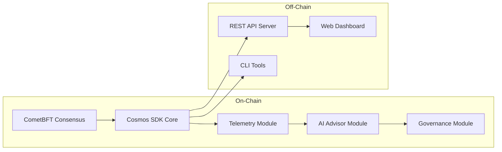

# Components

**LalaChain consists of five major components that work together to deliver AI-governed blockchain infrastructure.**

---

## Component Map



---

## 1. CometBFT Consensus Engine

**What:** The networking and consensus layer that connects validator nodes and produces blocks.

**Responsibilities:**
- Peer discovery and gossip protocol
- Transaction propagation (mempool)
- Block proposal round-robin
- Pre-vote, pre-commit, commit phases
- Finality guarantees

**Key Properties:**
- Byzantine Fault Tolerant (survives up to 1/3 malicious validators)
- Instant finality (no confirmations needed)
- Deterministic block production (~5 second cadence)

---

## 2. Cosmos SDK Application Framework

**What:** The middleware that connects consensus to application logic, providing standard modules.

**Provides:**
- `x/auth` — Account creation, nonce tracking, signature verification
- `x/bank` — Token transfers and balance management
- `x/staking` — Validator registration, delegation, unbonding
- `x/distribution` — Block reward distribution
- `x/slashing` — Validator punishment for misbehavior
- Module routing — Directs messages to correct handler

**Configuration:**
- Bond denomination: `ulala`
- DefaultPowerReduction: 1,000,000 (1M ulala = 1 voting power unit)

---

## 3. Telemetry Module (x/telemetry)

**What:** The "eyes" of the system — collects and aggregates on-chain performance data.

**Collects per block:**
- Gas used vs. gas limit (utilization)
- Base fee per gas
- Block timestamp (for block time calculation)
- Transaction count

**Computes per epoch:**
- Average block utilization
- Average base fee
- Average block time
- Total transaction count

**API:** `GET /lala/telemetry/v1/kpis`

```json
[
  {
    "epoch": 5,
    "avg_block_utilization": 0.35,
    "avg_base_fee": 750000000,
    "avg_block_time_ms": 5100,
    "tx_count": 42
  }
]
```

---

## 4. AI Advisor Module (x/aiadvisor)

**What:** The "brain" — a deterministic rule engine that evaluates KPIs and generates proposals.

**Rules:**

| Rule | Trigger | Action |
|------|---------|--------|
| R1 | Low utilization for 3+ epochs AND base fee below min target | Propose +5% gas limit |
| R2 | High utilization for 2+ epochs | Propose -5% gas limit |
| R3 | Base fee above max target | Propose -10% fee |
| R4 | Base fee below min target | Propose +5% fee |

**Configuration:**
- `MinFeeTarget`: 800,000,000 ulala/gas (800M)
- `MaxFeeTarget`: 5,000,000,000 ulala/gas (5B)
- `LowUtilThreshold`: 0.40 (40%)
- `HighUtilThreshold`: 0.80 (80%)

**State:** Maintains streak counters (consecutive epochs of low/high utilization)

**API:** `GET /lala/aiadvisor/v1/state`

---

## 5. Governance Module (x/lalagov)

**What:** The "hands" — manages the proposal lifecycle from creation through voting to activation.

**Lifecycle:**
1. Proposal created (by AI Advisor or manually)
2. Voting period opens (1 epoch)
3. Validators cast votes
4. Votes tallied at epoch end
5. If passed: activation delay (2 epochs)
6. Parameter change applied

**Parameters:**
- Quorum: 66% of voting power must participate
- Approval threshold: 51% of votes must be "Yes"
- Voting period: 1 epoch (~50 seconds)
- Activation delay: 2 epochs (~100 seconds)

**API:**
- `GET /lala/lalagov/v1/history` — resolved proposals
- `GET /lala/lalagov/v1/config` — governance parameters

---

## 6. REST API Server (Built-in)

**What:** HTTP interface for external applications to query chain state.

**Serves:**
- Custom LalaChain endpoints (telemetry, advisor, governance)
- Standard Cosmos SDK endpoints (accounts, balances, staking)
- CometBFT RPC proxy (blocks, transactions)

**Ports:**
- API: `localhost:1317`
- RPC: `localhost:26657`

---

## 7. Web Dashboard

**What:** A Next.js web application that visualizes chain performance and governance activity.

**Features:**
- Real-time KPI charts (utilization, fees, block time)
- Proposal history with vote breakdown
- Network status and validator info
- Parameter configuration display

**Stack:** Next.js 14, React, TypeScript, Tailwind CSS

---

## 8. CLI Tools (lalachaind)

**What:** Command-line interface for node operation, wallet management, and governance participation.

**Commands:**
```bash
lalachaind init          # Initialize a new node
lalachaind start         # Start the node
lalachaind keys add      # Create a wallet
lalachaind tx send       # Send tokens
lalachaind tx staking delegate    # Stake tokens
lalachaind query bank balances    # Check balance
```
