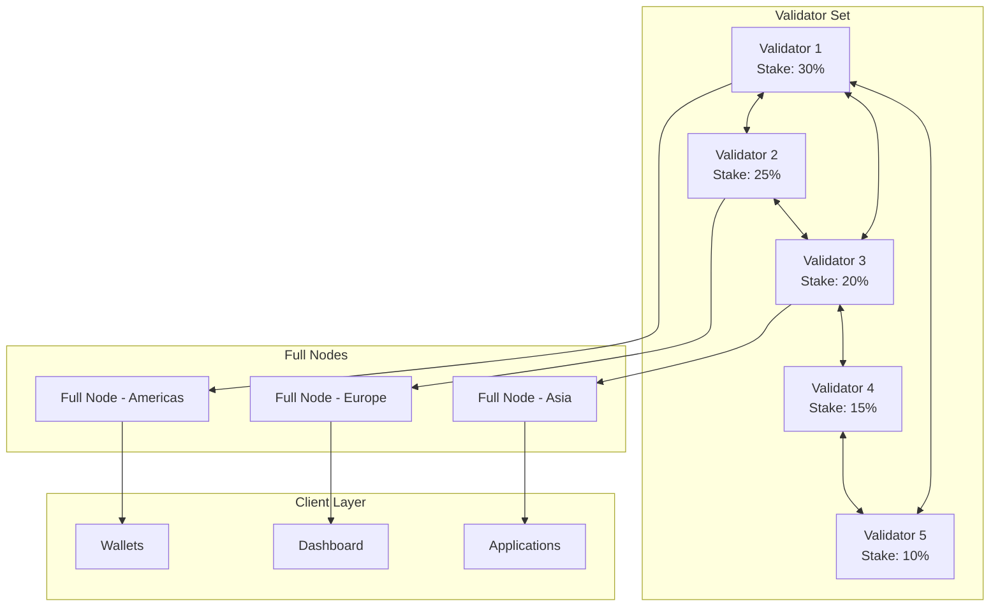
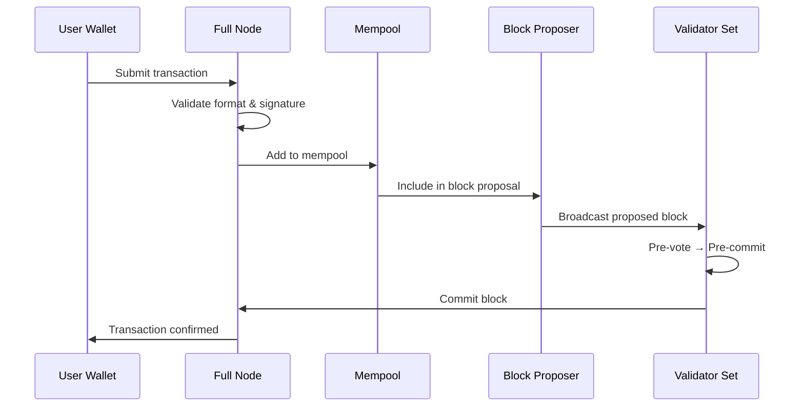
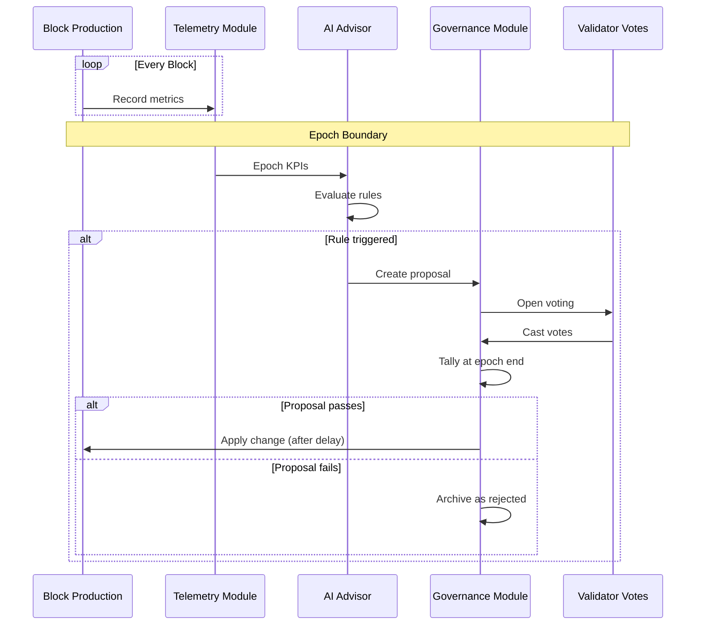

# Network Map

**A visual guide to LalaChain's network topology, data flows, and connectivity.**

---

## Network Topology

---

## Node Types

| Node Type | Purpose | Count | Requirement |
|-----------|---------|-------|-------------|
| **Validator** | Produce blocks, vote on proposals | Active set (up to 100) | High uptime, stake |
| **Full Node** | Serve API queries, relay transactions | Unlimited | Moderate hardware |
| **Archive Node** | Store complete historical state | Few | Large storage |
| **Seed Node** | Help new nodes discover peers | 2-3 | Reliable connectivity |
| **Sentry Node** | DDoS protection for validators | Per validator | Behind validator |

---

## Communication Protocols

### Validator ↔ Validator (P2P)

- **Protocol:** CometBFT gossip
- **Port:** 26656 (default)
- **Data:** Blocks, votes, transactions, consensus messages
- **Security:** Authenticated encryption, node IDs

### Node ↔ Client (API)

- **Protocol:** HTTP REST
- **Port:** 1317 (API), 26657 (RPC)
- **Data:** Queries, transaction broadcasts
- **Security:** TLS recommended for production

---

## Data Flow: Transaction Lifecycle

---

## Data Flow: AI Governance Cycle

---

## Network Ports

| Port | Service | Access |
|------|---------|--------|
| 26656 | P2P (CometBFT) | Validators/nodes only |
| 26657 | RPC (CometBFT) | Public or restricted |
| 1317 | REST API (Cosmos) | Public or restricted |
| 26660 | Prometheus metrics | Internal monitoring |
| 9090 | gRPC | Applications |

---

## Geographic Distribution

For a healthy network, validators should be geographically distributed:

| Region | Recommended Validators | Latency to Others |
|--------|----------------------|-------------------|
| North America | 30-40% | <100ms to EU |
| Europe | 30-40% | <150ms to Asia |
| Asia-Pacific | 20-30% | <200ms to NA |

Block time of ~5 seconds comfortably accommodates global validator distribution.

---

**Next:** Continue to [How It Works: Consensus](../how-it-works/consensus.md)
