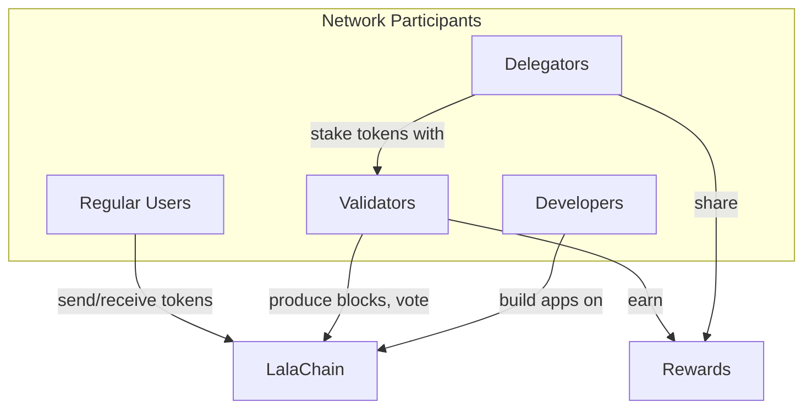

# User Roles

**LalaChain has four primary participant roles, each contributing differently to the network's health and governance.**

---

## Role Overview

---

## 1. Regular Users

**Who:** Anyone who holds or transacts with LALA tokens.

**Activities:**
- Send and receive LALA tokens
- Pay transaction fees
- View chain activity via dashboard
- Interact with applications built on LalaChain

**Requirements:**
- A wallet (address + private key)
- Some LALA tokens for fees

**No special hardware or technical knowledge needed.**

---

## 2. Delegators

**Who:** Token holders who stake their LALA with a validator to earn rewards without running a node.

**Activities:**
- Choose a trustworthy validator
- Delegate (stake) LALA tokens
- Earn a share of validator rewards
- Redelegate to a different validator if needed
- Undelegate (unstake) with an unbonding period

**Responsibilities:**
- Research validators before delegating (uptime, commission, reputation)
- Monitor validator performance
- Understand that if their validator misbehaves, delegators get slashed too

**Rewards:**
- Proportional share of block rewards minus validator commission
- No hardware costs, no operational overhead

---

## 3. Validators

**Who:** Node operators who run LalaChain infrastructure, produce blocks, and participate in governance.

**Activities:**
- Run a full node 24/7
- Propose and validate blocks
- **Vote on AI Advisor proposals** (unique to LalaChain)
- Participate in network upgrades
- Earn block rewards and transaction fees

**Responsibilities:**
- Maintain high uptime (95%+)
- Keep node software updated
- Evaluate AI proposals thoughtfully (not just auto-approve)
- Protect validator keys
- Set fair commission rates

**Extra on LalaChain:**

Unlike other chains where validators mostly just sign blocks, LalaChain validators are active governance participants. Every epoch, they may need to evaluate proposals like:

> "AI Advisor proposes: Increase block_gas_limit by 5% because avg_block_utilization has been below 0.40 for 3 consecutive epochs."

Validators must understand these proposals and vote responsibly.

---

## 4. Developers

**Who:** Software engineers who build applications, tools, or modules on LalaChain.

**Activities:**
- Build dApps using the REST API
- Create custom Cosmos SDK modules
- Develop smart contracts (CosmWasm)
- Build tools, explorers, wallets
- Contribute to LalaChain core development

**Resources:**
- REST API at `localhost:1317`
- Full Cosmos SDK documentation
- LalaChain-specific endpoints for telemetry and governance
- Go SDK for module development

---

## Role Comparison

| Aspect | User | Delegator | Validator | Developer |
|--------|------|-----------|-----------|-----------|
| Needs LALA? | Yes (for fees) | Yes (for staking) | Yes (self-bond) | Optional |
| Earns rewards? | No | Yes (passive) | Yes (active) | Indirect |
| Runs hardware? | No | No | Yes (24/7) | Development only |
| Votes on proposals? | No* | No* | **Yes** | No* |
| Technical skill? | Low | Low-Medium | High | High |
| Risk of slashing? | None | Yes (if validator slashed) | Yes | None |

*Governance voting on AI proposals is currently validator-only. Future upgrades may extend voting to delegators.

---

## The AI Advisor (Non-Human Role)

The AI Advisor is not a "user" but a system component worth mentioning:

- **Cannot** execute changes unilaterally
- **Cannot** vote on its own proposals
- **Can** analyze data and generate proposals
- **Can** be overridden by validators at any time
- **Operates** deterministically — same inputs always produce same outputs

It's a tool that serves the validator set, not an autonomous agent.
