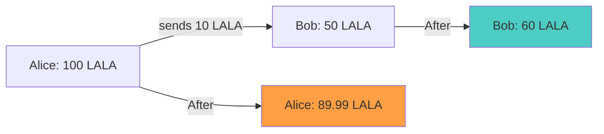

# What is a Token?

**A token is a digital unit of value that lives on a blockchain. On LalaChain, the native token is called LALA.**

---

## The Simple Explanation

A token is like an entry in a ledger that says "this address owns X units." It's not a physical thing — it's a number recorded on the blockchain that everyone agrees is yours.

You can think of tokens as:
- **Points** in a loyalty program (but transferable to anyone)
- **Shares** in a company (but without needing a broker)
- **Currency** in a video game (but usable in the real world)

---

## LALA Token

LALA is the native currency of LalaChain. It's used for:

| Use | Description |
|-----|-------------|
| **Transaction fees** | Pay validators to process your transactions |
| **Staking** | Lock tokens to secure the network and earn rewards |
| **Governance** | Vote on AI proposals and parameter changes |
| **Value transfer** | Send tokens to other users |

---

## Denominations

Like dollars have cents, LALA has smaller units:

| Unit | Amount | Analogy |
|------|--------|---------|
| 1 LALA | 1,000,000 ulala | $1.00 |
| 1 ulala | 1 ulala | $0.000001 |

The chain uses **ulala** (micro-LALA) internally. When you see amounts in the API or CLI, they're in ulala. User interfaces typically display in LALA.

```
1 LALA = 1,000,000 ulala
```

---

## Token vs. Coin

In blockchain terminology:
- **Coin** = native currency of a blockchain (LALA is LalaChain's coin)
- **Token** = asset created on top of someone else's blockchain (like USDC on Ethereum)

LALA is technically a **coin** because it's native to LalaChain. But "token" is often used interchangeably in casual conversation.

---

## How Tokens Work on LalaChain



When Alice sends 10 LALA to Bob:
- Alice's balance decreases by 10 LALA + fee (~0.01 LALA)
- Bob's balance increases by 10 LALA
- The fee goes to the validator who included the transaction

---

## Where Do Tokens Come From?

New LALA tokens enter circulation through:

1. **Block rewards** — Validators and their delegators earn new tokens for producing blocks
2. **Genesis allocation** — Initial distribution at chain launch
3. **Community pool** — A treasury governed by token holders

Tokens are **burned** (destroyed) when:
- Transaction fees are partially burned (deflationary pressure)
- Governance votes to burn community pool tokens

---

## Owning Tokens

You don't need anyone's permission to own LALA tokens. You just need a wallet (an address + private key). The blockchain records your balance, and your private key proves you can spend it.

Nobody can freeze your tokens, reverse your transactions, or prevent you from transferring — as long as you control your private key.
