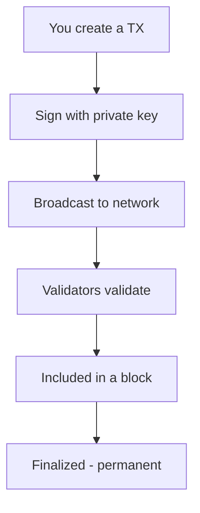

# What is a Transaction?

**A transaction is a signed instruction that tells the blockchain to do something — usually "move tokens from A to B."**

---

## The Simple Explanation

Think of a transaction like writing a check:
- You specify *who* gets the money (recipient address)
- You specify *how much* (amount)
- You *sign* it (with your private key)
- The bank (blockchain) processes it

But unlike a check, a blockchain transaction is:
- Processed in seconds, not days
- Irreversible — no "stop payment"
- Publicly visible — anyone can verify it happened

---

## Anatomy of a LalaChain Transaction



Every transaction contains:

| Field | Description | Example |
|-------|-------------|---------|
| **From** | Sender address | `lala1abc...` |
| **To** | Recipient address | `lala1xyz...` |
| **Amount** | How many tokens | `1000000ulala` (= 1 LALA) |
| **Fee** | Payment to validators for processing | `5000ulala` |
| **Gas** | Computational units required | `200000` |
| **Memo** | Optional message | `"Thanks for lunch"` |
| **Signature** | Proof that the sender authorized it | (cryptographic data) |

---

## Transaction Types on LalaChain

Sending tokens is just one type. LalaChain supports many:

| Type | What It Does |
|------|--------------|
| `MsgSend` | Transfer tokens between addresses |
| `MsgDelegate` | Stake tokens with a validator |
| `MsgUndelegate` | Unstake tokens (with unbonding period) |
| `MsgVote` | Vote on a governance proposal |
| `MsgSubmitProposal` | Submit a new governance proposal |

---

## Gas and Fees

Every transaction requires **gas** — a measure of how much computational work it takes. You pay for gas with LALA tokens.

```
Total Fee = Gas Used × Gas Price (base_fee_per_gas)
```

On LalaChain, the base fee adjusts automatically based on network demand (similar to Ethereum's EIP-1559). When the network is busy, fees go up. When it's quiet, fees go down. The AI Advisor monitors this and can propose adjustments if fees drift too far from healthy ranges.

---

## Transaction Lifecycle

1. **Create** — You build the transaction message
2. **Sign** — Your wallet signs it with your private key
3. **Broadcast** — Sent to a validator node
4. **Mempool** — Sits in a waiting area until included in a block
5. **Inclusion** — A validator puts it into the next block
6. **Consensus** — 2/3+ validators agree the block is valid
7. **Finalized** — Permanently recorded. Done.

On LalaChain, steps 4–7 happen in roughly **5 seconds** (one block time).

---

## Important Notes

- **Transactions are irreversible.** Double-check addresses before sending.
- **Fees are non-refundable.** Even if a transaction fails (e.g., insufficient balance), you still pay the gas fee.
- **Each account has a sequence number** that prevents replay attacks — you can't submit the same transaction twice.
