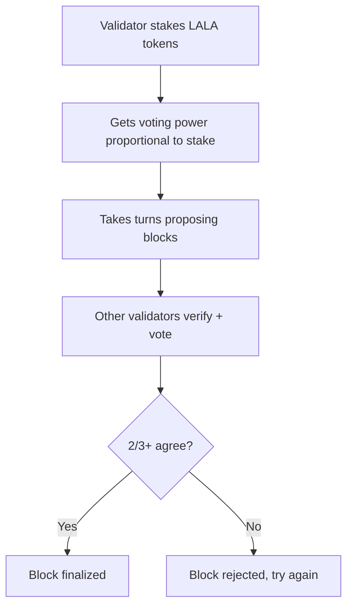

# What is a Validator?

**A validator is a computer that helps run the blockchain by proposing new blocks and voting on whether blocks are valid.**

---

## The Simple Explanation

If the blockchain is a shared record book, validators are the accountants who:
1. Check that new entries are legitimate
2. Add approved entries to the book
3. Keep identical copies synchronized

In return for this work, validators earn rewards (new LALA tokens + transaction fees).

---

## Why Do We Need Validators?

Without validators, anyone could write anything into the blockchain — including lies like "I have 1 billion tokens." Validators exist to:

- **Verify transactions** — "Does Alice actually have the 10 LALA she's trying to send?"
- **Propose blocks** — Bundle valid transactions into blocks
- **Reach consensus** — Agree with other validators on what the next block should be
- **Secure the network** — Make it economically impossible to cheat

---

## How It Works on LalaChain

LalaChain uses **CometBFT** (formerly Tendermint) consensus with a **proof-of-stake** system:

Key facts:
- A new block is produced every ~5 seconds
- 2/3+ of validators (by stake weight) must agree to finalize a block
- Once finalized, blocks are **permanent** — no reorganizations
- Validators are selected to propose blocks based on their stake weight

---

## Staking

To become a validator, you must **stake** (lock up) LALA tokens as collateral. This serves two purposes:

1. **Skin in the game** — Validators risk losing their stake if they misbehave
2. **Sybil resistance** — Prevents someone from spinning up 1000 fake validators cheaply

Regular users can **delegate** their tokens to a validator they trust, earning a share of that validator's rewards without running a node themselves.

---

## Rewards and Punishments

| Behavior | Consequence |
|----------|-------------|
| Produce valid blocks | Earn block rewards + transaction fees |
| Sign attestations correctly | Keep your stake intact |
| Go offline for too long | **Slashed** — lose a portion of staked tokens |
| Sign conflicting blocks (double-sign) | **Jailed + heavily slashed** |

---

## Validators on LalaChain: Special Role

On most blockchains, validators just process transactions. On LalaChain, validators have an extra responsibility: **voting on AI proposals**.

When the AI Advisor detects a performance issue and proposes a parameter change, validators must evaluate and vote:
- **Yes** — "I agree this change will improve the network"
- **No** — "I disagree or don't trust this recommendation"
- **Abstain** — "I don't have a strong opinion"

This makes LalaChain validators more than block producers — they're active governance participants in a human-AI partnership.

---

## Validator Requirements (Summary)

| Requirement | Details |
|-------------|---------|
| Hardware | 4+ CPU cores, 16GB+ RAM, 500GB+ SSD |
| Connectivity | Stable internet, low latency |
| Stake | Minimum self-bond (configurable) |
| Uptime | 95%+ expected for full rewards |
| Knowledge | Understand blockchain operations + AI proposals |

For full details, see [Validator Requirements](../validators/requirements).
