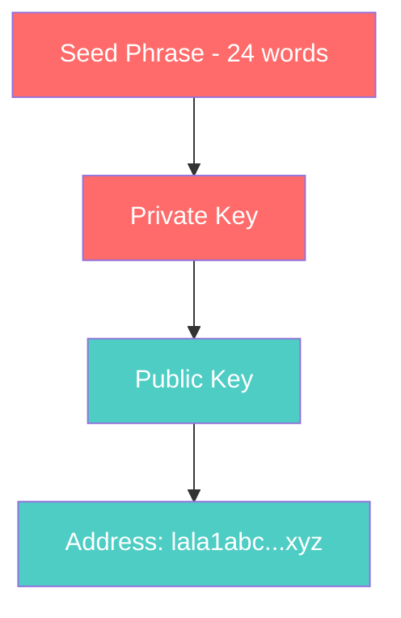

# What is a Wallet?

**A wallet is your personal key to the blockchain — it lets you own, send, and receive digital tokens.**

---

## The Simple Explanation

A blockchain wallet is like a mailbox with a combination lock:
- **Your address** (public) = the mailbox number. Anyone can send things to it.
- **Your private key** (secret) = the combination. Only you can open it and take things out.

You don't actually "store" tokens in a wallet. The tokens live on the blockchain. Your wallet just proves you're the rightful owner — like having the deed to a house.

---

## Wallet Anatomy



| Component | Visibility | Purpose |
|-----------|-----------|---------|
| **Seed phrase** | SECRET — never share | Master backup of your wallet. 24 words that can regenerate everything. |
| **Private key** | SECRET — never share | Signs transactions to prove they came from you |
| **Public key** | Safe to share | Mathematical counterpart to the private key |
| **Address** | Safe to share | Short version of public key. Used to receive tokens. Starts with `lala1` |

---

## On LalaChain

LalaChain wallet addresses start with the `lala` prefix. For example:

```
lala1qnk2n4nlkpw9xfqntladh74w6ux37lk3pzd7yh
```

You can create a wallet using the LalaChain CLI:

```bash
lalachaind keys add my-wallet
```

This gives you an address, public key, and (critically important) a 24-word seed phrase. **Write it down. Store it offline. Never share it.**

---

## Types of Wallets

| Type | Description | Best For |
|------|-------------|----------|
| **CLI Wallet** | Built into `lalachaind` binary | Developers, validators |
| **Browser Extension** | Keplr, Leap (Cosmos-compatible) | Everyday users |
| **Hardware Wallet** | Ledger, physical device | Large holdings, maximum security |
| **Multi-sig** | Requires multiple signatures | Teams, treasuries |

---

## What Can You Do With a Wallet?

1. **Hold LALA tokens** — your balance is recorded on-chain
2. **Send tokens** — sign a transaction with your private key
3. **Stake tokens** — delegate to validators to earn rewards
4. **Vote on proposals** — participate in governance
5. **Pay fees** — every transaction costs a small fee in ulala

---

## Security Rules

1. **Never share your seed phrase or private key** — anyone who has it controls your funds
2. **Write your seed phrase on paper** — not in a file, not in a screenshot, not in email
3. **Use a hardware wallet for large amounts** — keeps your key offline
4. **Verify addresses before sending** — blockchain transactions are irreversible

---

**Next:** [What is a Transaction?](what-is-a-transaction.md)
