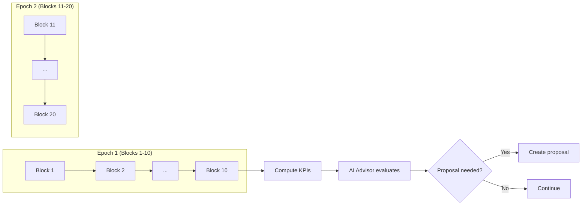

---
title: "What is an Epoch?"
description: "How LalaChain divides time into epochs for AI-driven governance."
---

# What is an Epoch?

**An epoch is a fixed group of blocks (10 on LalaChain) that the chain uses as a measurement window for performance analysis.**

---

## The Simple Explanation

If blocks are individual heartbeats, an epoch is a full breath cycle. The chain measures its vital signs once per epoch rather than once per block — giving it a more stable picture of network health.

Think of it like a teacher checking the classroom temperature every 10 minutes instead of every 30 seconds. Individual moments might fluctuate, but a 10-minute average reveals actual trends.

---

## Why Epochs Matter

Without epochs, the AI Advisor would react to every tiny fluctuation:
- One empty block? "Utilization is 0%! Emergency!"
- One full block? "Overloaded! Cut capacity!"

That's noisy and counterproductive. Epochs provide **smoothing** — the chain aggregates data over 10 blocks (~50 seconds) before making any decisions.

---

## Epoch Timeline

---

## What Happens Each Epoch

At the end of every 10th block:

1. **KPI Computation** — The telemetry module calculates:
   - Average block utilization (gas used / gas limit)
   - Average base fee per gas
   - Average block time (seconds between blocks)
   - Transaction count

2. **AI Analysis** — The AI Advisor checks its rules:
   - Has utilization been low for 3+ epochs in a row? → Propose gas limit increase
   - Has utilization been high for 2+ epochs? → Propose gas limit decrease
   - Is base fee above maximum target? → Propose fee reduction
   - Is base fee below minimum target? → Propose fee increase

3. **Proposal Generation** — If a rule triggers, a signed proposal is created

4. **Governance** — Outstanding proposals are voted on by validators

5. **Activation** — Approved proposals take effect after a 2-epoch safety delay

---

## Epoch Parameters

| Parameter | Value | Meaning |
|-----------|-------|---------|
| Epoch length | 10 blocks | ~50 seconds per epoch |
| Voting period | 1 epoch | Validators have one epoch to vote |
| Activation delay | 2 epochs | Approved changes wait 2 epochs before applying |
| Streak threshold (low) | 3 epochs | AI needs 3 low-utilization epochs before proposing |
| Streak threshold (high) | 2 epochs | AI needs 2 high-utilization epochs before proposing |

---

## Why 10 Blocks?

The epoch length balances two concerns:

- **Too short** (1-2 blocks): Noisy data, overreaction to temporary spikes
- **Too long** (100+ blocks): Slow to detect and respond to real problems

10 blocks (~50 seconds) provides:
- Enough data to smooth out noise
- Fast enough to react within minutes
- Matching the experience that "things feel responsive" to users

The epoch length itself is a governance parameter — validators could vote to change it if needed.

---

## Epoch in Context

| Concept | Granularity | Purpose |
|---------|-------------|---------|
| Block | ~5 seconds | Process transactions |
| Epoch | ~50 seconds (10 blocks) | Measure performance, trigger governance |
| Voting period | ~50 seconds (1 epoch) | Time for validators to vote |
| Activation delay | ~100 seconds (2 epochs) | Safety buffer before changes apply |

