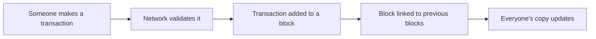

# What is Blockchain?

**A blockchain is a shared digital record book that nobody can secretly change.**

---

## The Simple Explanation

Think of a Google Doc that everyone in the world can read. But instead of one person being able to edit it, changes can only be added if most of the participants agree the change is valid. And once something is written, it can never be erased or modified.

That's a blockchain: a shared, permanent, tamper-proof record.

---

## Real-Life Analogy

Imagine a town with no bank. Instead, every person in town keeps an identical copy of a ledger that records who owns what. When Alice pays Bob 10 coins:

1. Alice announces: "I'm sending Bob 10 coins"
2. Everyone checks their copy: "Does Alice have 10 coins? Yes."
3. Everyone writes it down simultaneously
4. Now all ledgers show Alice has 10 fewer coins and Bob has 10 more

Nobody can cheat because everyone has the same records. If someone tries to write "I have 1 million coins," the rest of the town will reject it because their copies don't match.

---

## How It Works (Simplified)

A **block** is a batch of transactions bundled together. Each block is mathematically linked to the previous one (using cryptographic hashes), forming a **chain** — hence "blockchain."

---

## Key Properties

| Property | What it means | Why it matters |
|----------|--------------|----------------|
| **Decentralized** | No single company runs it | Can't be shut down or censored |
| **Immutable** | Records can't be changed after the fact | Prevents fraud |
| **Transparent** | Anyone can verify the records | Builds trust without middlemen |
| **Permissionless** | Anyone can participate | No gatekeepers |

---

## How It Works in LalaChain

LalaChain is a blockchain built using the Cosmos SDK framework with CometBFT consensus. Every ~5 seconds, a new block is created containing any pending transactions. Validators (special participants who stake LALA tokens) take turns proposing blocks, and 2/3+ of validators must agree before a block is finalized.

What makes LalaChain special isn't the blockchain itself — it's what runs *on top* of it: an AI system that monitors chain health and proposes performance improvements automatically.

---

## 💡 Key Takeaway

A blockchain is just a database that's shared, permanent, and doesn't need anyone in charge to manage it. LalaChain is one such database — with the added superpower of self-optimization.

---

**Next:** [What is a Wallet?](what-is-a-wallet.md)
