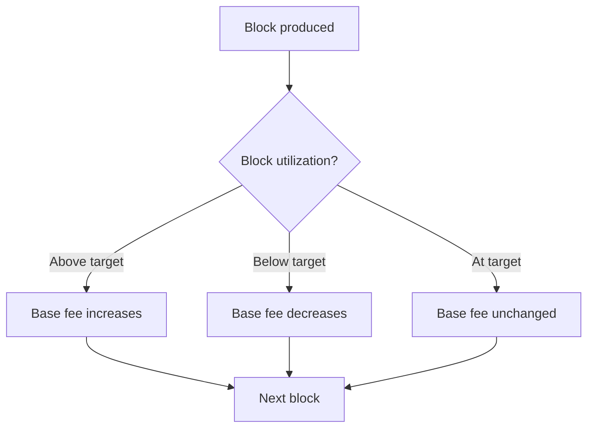

# What is Gas?

**Gas is a unit measuring computational effort. Every transaction costs gas, and you pay for gas with LALA tokens.**

---

## The Simple Explanation

Gas is like fuel for your car:
- Driving farther (more complex transaction) = more fuel needed
- Fuel price changes based on demand (busy network = expensive gas)
- You pay at the pump (fee attached to your transaction)

The key insight: gas separates "how much work" from "how much it costs." The work is fixed (sending tokens always takes ~65,000 gas). The cost fluctuates with demand.

---

## How Gas Works

```
Transaction Fee = Gas Used × Base Fee Per Gas
```

| Component | What It Is | Example |
|-----------|-----------|---------|
| **Gas limit** | Maximum gas you're willing to spend | 200,000 |
| **Gas used** | Actual gas consumed | 65,000 |
| **Base fee** | Current price per unit of gas (in ulala) | 1,000,000,000 (1B) |
| **Total fee** | What you actually pay | 65,000 × 1B = 65,000,000,000 ulala = 65,000 ulala |

If your transaction uses less gas than the limit, you only pay for what was used. If it would exceed the limit, the transaction fails (but you still pay for the gas consumed up to that point).

---

## Why Does Gas Exist?

Without gas limits, someone could submit a transaction that runs forever, freezing the network. Gas ensures:

1. **Every operation has a cost** — prevents spam
2. **Blocks have capacity limits** — the network can't be overloaded
3. **Validators are compensated** — they're paid for the work they do

---

## LalaChain's Dynamic Fee Model

LalaChain uses an **EIP-1559-style** fee mechanism:



- When blocks are more than 50% full → base fee goes **up**
- When blocks are less than 50% full → base fee goes **down**
- This creates a self-adjusting market for block space

---

## Gas Costs for Common Operations

| Operation | Approximate Gas |
|-----------|----------------|
| Simple token transfer | ~65,000 |
| Delegate (stake) tokens | ~150,000 |
| Vote on proposal | ~100,000 |
| Submit proposal | ~200,000 |

---

## The AI Advisor and Gas

Here's where LalaChain is unique: the **block gas limit** (maximum gas per block) is a tunable parameter that the AI Advisor monitors.

If the network is consistently underutilized (blocks less than 40% full for 3+ epochs), the AI might propose:
> "Increase block gas limit by 5% to allow more transactions per block."

If blocks are consistently overloaded (above 80% for 2+ epochs), it might propose:
> "Decrease block gas limit by 5% to maintain stability."

These proposals require validator approval before taking effect.

---

## Tips for Users

- **Don't set gas limits too low** — your transaction will fail and you'll still pay partial fees
- **Use wallet defaults** — most wallets auto-estimate gas correctly
- **Busy networks cost more** — if fees seem high, wait for less congested times
- **On LalaChain, fees self-correct** — the AI ensures fees don't stay unreasonable for long
