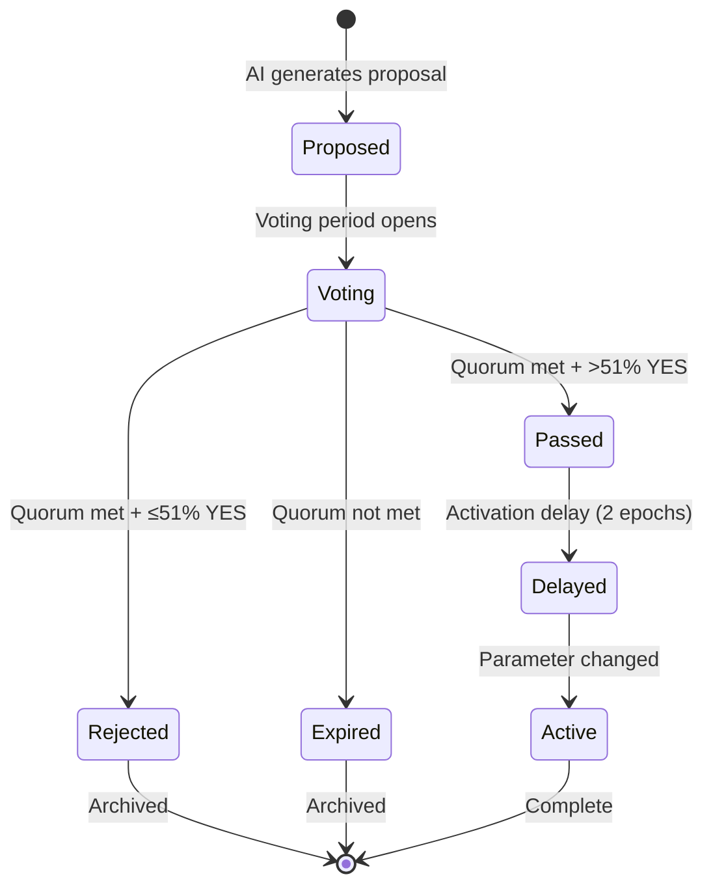

# Governance Overview

**LalaChain's governance combines AI-driven proposals with human validator voting, enabling rapid parameter optimization while maintaining decentralized control.**

---

## What Makes LalaChain Governance Different

| Traditional Governance | LalaChain Governance |
|----------------------|---------------------|
| Humans identify problems | AI detects problems from data |
| Humans draft proposals | AI generates proposals with evidence |
| Days-to-months voting | ~50-second voting period |
| Manual activation | Automatic activation after delay |
| Political dynamics | Data-driven decisions |

---

## Governance Scope

The AI Advisor can propose changes to these parameters:

| Parameter | Range | Change Limit |
|-----------|-------|-------------|
| `block_gas_limit` | 10M - 30M | ±5% per proposal |
| `base_fee_per_gas` | 100M - 10B | ±10% per proposal |
| `target_block_time_ms` | 1,000 - 20,000 | ±10% per proposal |

All other protocol changes (upgrades, new modules, etc.) use traditional governance proposals requiring community discussion.

---

## Governance Parameters

| Parameter | Value | Meaning |
|-----------|-------|---------|
| Quorum | 66% | Minimum participation for valid vote |
| Approval threshold | 51% | Minimum YES votes to pass |
| Voting period | 1 epoch (~50s) | Time window for voting |
| Activation delay | 2 epochs (~100s) | Safety buffer before activation |

---

## Governance Flow

---

## Who Participates

Currently, **only active validators** vote on AI proposals. Voting power is proportional to total stake (self-bond + delegations).

### Future Expansion
- Delegator voting (override validator's vote)
- Weighted voting (conviction-based)
- Community proposals (non-AI parameter changes)

---

## Transparency

Every governance action is recorded on-chain:
- Proposal creation (with full AI rationale)
- Individual validator votes
- Vote tally results
- Parameter before/after values
- Activation timestamp

Query via: `GET /lala/lalagov/v1/history`
