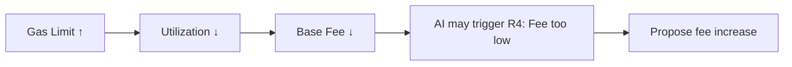

# Parameter Changes

**The specific parameters that AI governance can modify, their ranges, and their effects.**

---

## Governable Parameters

### block_gas_limit

| Property | Value |
|----------|-------|
| Current default | 10,000,000 (10M) |
| Minimum | 10,000,000 (10M) |
| Maximum | 30,000,000 (30M) |
| Max change per proposal | ±5% |
| Controlled by rules | R1 (increase), R2 (decrease) |

**Effect of increase:** More transactions fit per block → lower fees → more throughput
**Effect of decrease:** Fewer transactions per block → higher fees → less throughput

---

### base_fee_per_gas

| Property | Value |
|----------|-------|
| Current default | 1,000,000,000 (1B ulala/gas) |
| Minimum | 100,000,000 (100M ulala/gas) |
| Maximum | 10,000,000,000 (10B ulala/gas) |
| Max change per proposal | ±10% |
| Controlled by rules | R3 (decrease), R4 (increase) |

**Effect of increase:** Transactions cost more → less spam → validators earn more per tx
**Effect of decrease:** Transactions cost less → more accessible → validators earn less per tx

---

### target_block_time_ms (Future)

| Property | Value |
|----------|-------|
| Current default | 5,000 (5 seconds) |
| Minimum | 1,000 (1 second) |
| Maximum | 20,000 (20 seconds) |
| Max change per proposal | ±10% |
| Controlled by rules | Not yet implemented |

**Effect of decrease:** Faster blocks → more responsive → higher hardware requirements
**Effect of increase:** Slower blocks → more tolerant of latency → fewer transactions per second

---

## Safety Mechanisms

### Hard Bounds
Parameters can NEVER exceed their absolute min/max, regardless of how many proposals pass:
- Even if 100 consecutive proposals try to increase gas_limit, it stops at 30M

### Incremental Changes
Maximum ±5-10% per proposal means:
- To go from 10M to 30M gas limit requires ~22 sequential proposals
- Each must pass individual governance vote
- Provides extensive time for observation and course correction

### Rate Limiting
- Only one proposal per parameter per epoch
- Each proposal takes 4 epochs minimum (voting + delay)
- Practical maximum: ~1 change per 200 seconds per parameter

---

## Parameter Interaction

Changes to one parameter affect the others:



The AI's rule engine accounts for these interactions through its streak mechanism — it waits for sustained trends before acting.

---

## History Query

View all past parameter changes:

```bash
curl http://localhost:1317/lala/lalagov/v1/history
```
