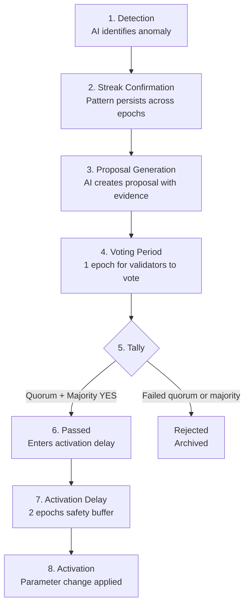

# Proposal Lifecycle

**Every AI-generated proposal follows a strict lifecycle from detection to activation.**

---

## Complete Lifecycle



---

## Phase Details

### 1. Detection (Continuous)

Every epoch, the telemetry module computes KPIs and the AI Advisor checks against thresholds:
- Is utilization below 40%? (low streak)
- Is utilization above 80%? (high streak)
- Is base fee outside the target band?

### 2. Streak Confirmation (Multi-epoch)

The AI doesn't react to single anomalies. It requires **sustained patterns**:
- Low utilization: 3 consecutive epochs
- High utilization: 2 consecutive epochs
- Fee out of bounds: immediate (1 epoch)

### 3. Proposal Generation (Epoch boundary)

When a rule triggers, the AI creates a proposal containing:
```json
{
  "id": "prop-epoch-15-R1",
  "parameter": "block_gas_limit",
  "current_value": 10000000,
  "proposed_value": 10500000,
  "rule": "R1",
  "rationale": "...",
  "evidence": { "utilization": [0.32, 0.28, 0.35] }
}
```

### 4. Voting Period (1 epoch = ~50 seconds)

- All active validators can vote: YES, NO, or ABSTAIN
- Voting power = total stake
- Validators should evaluate the proposal quickly

### 5. Tally (End of voting period)

| Condition | Result |
|-----------|--------|
| ≥66% participation AND >51% YES | **Passed** |
| ≥66% participation AND ≤51% YES | **Rejected** |
| <66% participation | **Expired** (treated as rejected) |

### 6. Activation Delay (2 epochs = ~100 seconds)

After passing, the change doesn't apply immediately:
- Allows ecosystem to prepare
- Emergency override possible during this window
- Validators can observe and alert if something seems wrong

### 7. Activation

At the next epoch boundary after the delay expires:
- Parameter value is updated
- AI streak counters are reset
- New baseline established for future monitoring

---

## Timeline

| Event | Time | Cumulative |
|-------|------|-----------|
| AI detects anomaly | Epoch N end | 0s |
| Proposal created | Epoch N end | 0s |
| Voting opens | Epoch N+1 start | ~0s |
| Voting closes | Epoch N+1 end | ~50s |
| Delay period 1 | Epoch N+2 | ~100s |
| Delay period 2 | Epoch N+3 | ~150s |
| **Change activates** | **Epoch N+4 start** | **~200s** |

**Total: ~200 seconds from detection to activation.**

---

## What Happens After Rejection?

If a proposal is rejected:
1. It's archived in the history (with vote breakdown)
2. The AI's streak counters remain active
3. If conditions persist, the AI will propose again next epoch
4. Validators can continue to reject indefinitely
5. The AI doesn't "learn" from rejection (deterministic rules)

---

## Proposal Limits

- Only one proposal per parameter per epoch
- Only one active proposal per parameter at a time
- AI cannot override a rejected proposal immediately
