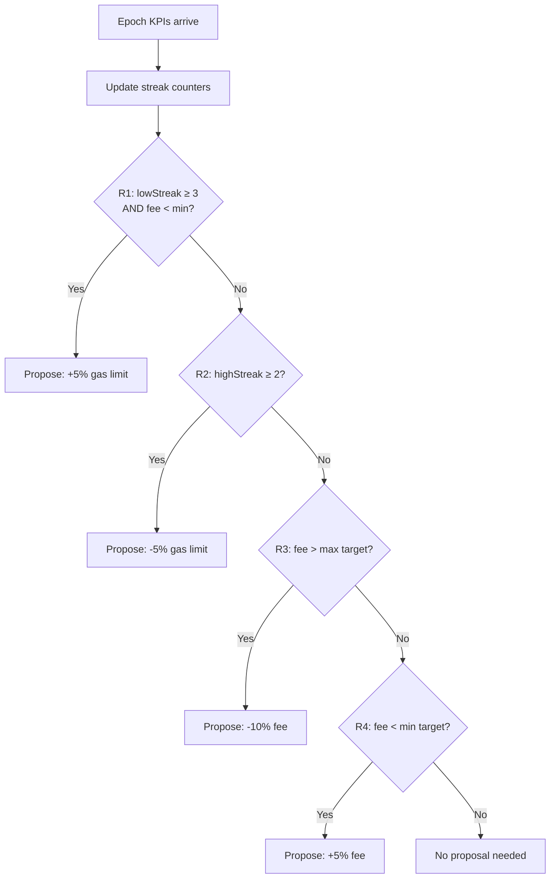

# AI Advisor

**The AI Advisor is a deterministic rule engine embedded in LalaChain that monitors network performance and generates parameter-optimization proposals for validator approval.**

---

## What It Is (and Isn't)

### What it IS:
- A **deterministic rule engine** — same inputs always produce same outputs
- An **advisory system** — proposes changes, never executes them unilaterally
- **Transparent** — every decision includes human-readable rationale
- **Bounded** — can only suggest values within predefined safety limits
- **On-chain** — runs identically on every validator node

### What it is NOT:
- Not a neural network or machine learning model
- Not autonomous — requires validator vote to enact changes
- Not upgradeable without governance — rules are fixed in code
- Not a black box — every decision is fully explainable

---

## How It Works



---

## Rule Definitions

### Rule 1: Low Utilization + Low Fees

**Trigger:** Average block utilization below 40% for 3+ consecutive epochs AND average base fee below 800M ulala/gas.

**Action:** Propose increasing `block_gas_limit` by 5%.

**Rationale:** The network has excess capacity going unused AND fees are already low. Increasing the gas limit allows more transactions per block without raising costs.

---

### Rule 2: High Utilization

**Trigger:** Average block utilization above 80% for 2+ consecutive epochs.

**Action:** Propose decreasing `block_gas_limit` by 5%.

**Rationale:** Blocks are consistently near-full, which creates fee pressure and risks congestion. Reducing the limit forces the fee market to price out lower-value transactions.

---

### Rule 3: Fee Ceiling Breach

**Trigger:** Average base fee exceeds 5B ulala/gas (MaxFeeTarget).

**Action:** Propose decreasing base fee by 10%.

**Rationale:** Fees are unsustainably high — users are being priced out. A direct fee reduction improves accessibility.

---

### Rule 4: Fee Floor Breach

**Trigger:** Average base fee falls below 800M ulala/gas (MinFeeTarget).

**Action:** Propose increasing base fee by 5%.

**Rationale:** Fees are too low to adequately compensate validators and provide spam protection. A modest increase maintains network sustainability.

---

## Configuration

```json
{
  "min_fee_target": 800000000,
  "max_fee_target": 5000000000,
  "low_util_threshold": 0.40,
  "high_util_threshold": 0.80,
  "low_streak_required": 3,
  "high_streak_required": 2,
  "gas_limit_adjustment": 0.05,
  "fee_increase_adjustment": 0.05,
  "fee_decrease_adjustment": 0.10
}
```

These configuration values are governance-adjustable parameters. Validators can vote to change the AI's sensitivity without a code upgrade.

---

## Streak Tracking

The AI maintains **streak counters** that track consecutive epochs of abnormal behavior:

| Counter | Increments When | Resets When |
|---------|----------------|-------------|
| `lowStreak` | `avgUtilization < 0.40` | `avgUtilization ≥ 0.40` |
| `highStreak` | `avgUtilization > 0.80` | `avgUtilization ≤ 0.80` |

Streaks prevent the AI from reacting to one-off anomalies. A single slow epoch doesn't trigger action — it takes sustained patterns.

---

## Proposal Format

When a rule triggers, the AI generates:

```json
{
  "id": "prop-epoch-15-R1",
  "type": "parameter_change",
  "parameter": "block_gas_limit",
  "current_value": 10000000,
  "proposed_value": 10500000,
  "direction": "increase",
  "magnitude": "5%",
  "rule": "R1",
  "rationale": "avg_block_utilization below 0.40 for 3 consecutive epochs (streak=3) and avg_base_fee (750000000) below min_fee_target (800000000). Increasing gas limit to allow more throughput.",
  "epoch_created": 15,
  "kpi_evidence": {
    "avg_utilization_3_epochs": [0.32, 0.28, 0.35],
    "avg_base_fee": 750000000
  }
}
```

---

## Safety Bounds

The AI can NEVER propose values outside these hard limits:

| Parameter | Minimum | Maximum |
|-----------|---------|---------|
| `block_gas_limit` | 10,000,000 (10M) | 30,000,000 (30M) |
| `base_fee_per_gas` | 100,000,000 (100M) | 10,000,000,000 (10B) |
| `target_block_time_ms` | 1,000 (1s) | 20,000 (20s) |

Even if the AI's rules suggest a change that would breach these bounds, the proposal is clamped to the limit.

---

## Why Deterministic Rules (Not ML)?

| Factor | Deterministic Rules | Machine Learning |
|--------|--------------------|-|
| **Reproducibility** | ✅ Same on all nodes | ❌ Floating-point drift |
| **Auditability** | ✅ Fully explainable | ❌ Black box |
| **Consensus compatibility** | ✅ All validators agree | ❌ Non-deterministic |
| **Safety** | ✅ Bounded, predictable | ⚠️ Potential edge cases |
| **Upgradability** | Via governance vote | Requires retraining |

For a governance-critical system, **predictability and auditability** outweigh the flexibility of ML. Validators must be able to verify *why* a proposal was generated and confirm it matches on their own node.

---

## Monitoring the AI

Query the current AI state via the REST API:

```
GET /lala/aiadvisor/v1/state
```

Returns:
```json
{
  "low_streak": 2,
  "high_streak": 0,
  "last_proposal_epoch": 12,
  "config": {
    "min_fee_target": 800000000,
    "max_fee_target": 5000000000,
    "low_util_threshold": 0.40,
    "high_util_threshold": 0.80
  }
}
```

---

**Next:** [Fee Model](fee-model.md)
