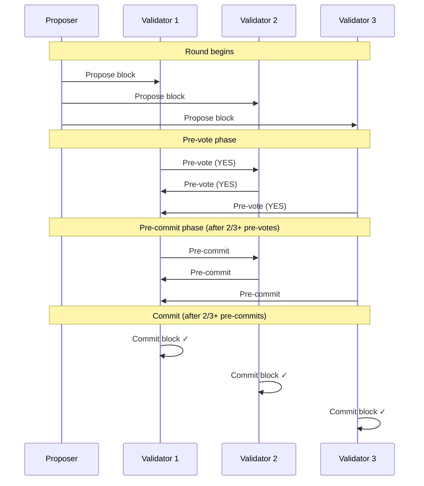

# Consensus

**LalaChain uses CometBFT (formerly Tendermint) — a Byzantine Fault Tolerant consensus protocol that provides instant finality and consistent block production.**

---

## What is Consensus?

Consensus is the process by which a distributed network agrees on the current state. Without it, different validators might disagree about who owns what, leading to chaos.

LalaChain's consensus ensures:
- All validators agree on the same transaction order
- Once a block is committed, it's **permanently final** (no rollbacks)
- The network functions correctly even if up to 1/3 of validators are malicious

---

## CometBFT Overview

CometBFT implements a variant of PBFT (Practical Byzantine Fault Tolerance):

---

## Consensus Phases

### 1. Propose

A validator is selected as the **proposer** for this round (weighted by stake). They:
- Collect transactions from the mempool
- Build a candidate block
- Broadcast it to all validators

### 2. Pre-vote

Each validator:
- Receives the proposed block
- Validates all transactions (signatures, balances, rules)
- Broadcasts a **pre-vote** (YES if valid, NIL if invalid/timeout)

### 3. Pre-commit

If 2/3+ of voting power pre-voted YES:
- Validators broadcast a **pre-commit**
- This signals: "I've seen enough agreement to commit"

### 4. Commit

If 2/3+ of voting power pre-committed:
- The block is **finalized** — added to the chain permanently
- State transitions are applied
- Next round begins

---

## Key Properties

| Property | Description |
|----------|-------------|
| **Instant finality** | Once committed, blocks can never be reversed. No "6 confirmations needed." |
| **BFT tolerance** | Network survives up to 1/3 of validators being offline or malicious |
| **Deterministic** | Same transactions always produce the same state |
| **Leader rotation** | Proposer rotates based on stake weight (prevents monopoly) |
| **Accountability** | Misbehaving validators are identifiable and punishable |

---

## Proposer Selection

The proposer for each round is chosen deterministically based on:
- Validator's voting power (proportional to stake)
- A weighted round-robin algorithm

A validator with 30% of total stake will propose roughly 30% of blocks.

---

## Fault Tolerance

| Scenario | Network Behavior |
|----------|-----------------|
| 1-2 validators offline (of 10) | Normal operation, slightly slower |
| 3 validators offline (of 10) | Halts — can't reach 2/3 agreement |
| 1 validator double-signs | Detected, slashed, jailed |
| Network partition | Minority side halts; majority continues |

**Safety over liveness:** CometBFT will **stop** rather than allow conflicting blocks. This means the network might pause but will never produce incorrect state.

---

## Comparison to Other Consensus Mechanisms

| Mechanism | Used By | Finality | Throughput | Energy |
|-----------|---------|----------|------------|--------|
| Proof of Work | Bitcoin, Ethereum (old) | Probabilistic (~60 min) | Low | Massive |
| Nakamoto PoS | Cardano | Probabilistic (~minutes) | Medium | Low |
| **CometBFT** | **LalaChain**, Cosmos | **Instant** | **Medium-High** | **Low** |
| HotStuff | Aptos, Sui | Fast (~1s) | High | Low |

---

## Block Production on LalaChain

| Parameter | Value |
|-----------|-------|
| Target block time | ~5 seconds |
| Validator set size | Up to 100 active |
| Consensus threshold | 2/3+ of voting power |
| Finality | Immediate (single-slot) |
| Empty blocks | Produced (maintains chain liveness) |

---

## Why CometBFT for LalaChain?

1. **Instant finality** — Critical for AI governance. When a parameter change is approved, it needs to take effect at a predictable time, not "eventually."
2. **Deterministic** — The AI Advisor's rule engine must produce identical results on every validator. BFT consensus guarantees all nodes process the same blocks.
3. **Cosmos ecosystem** — IBC compatibility for cross-chain communication.
4. **Battle-tested** — Used by 50+ production blockchains.

---

**Next:** [Transaction Lifecycle](transaction-lifecycle.md)
