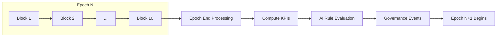

# Epoch System

**The epoch system is LalaChain's heartbeat for governance — a 10-block window that triggers performance measurement, AI analysis, and proposal lifecycle events.**

---

## What is an Epoch?

An epoch is a fixed interval of 10 consecutive blocks (~50 seconds) during which the chain accumulates performance data. At each epoch boundary, the system:

1. Computes aggregate KPIs
2. Runs the AI Advisor rule engine
3. Processes governance lifecycle events



---

## Epoch End Processing

At the end of every epoch (block height % 10 == 0), the `EndBlocker` executes:

### Phase 1: KPI Computation (x/telemetry)

Aggregates per-block metrics collected during the epoch:

```go
type EpochKPI struct {
    Epoch               int64
    AvgBlockUtilization float64  // gas_used / gas_limit averaged
    AvgBaseFee          int64    // mean base fee per gas
    AvgBlockTimeMs      int64    // mean milliseconds between blocks
    TxCount             int64    // total transactions in epoch
}
```

### Phase 2: AI Rule Evaluation (x/aiadvisor)

The advisor checks four rules against current KPIs and historical streaks:

| Rule | Condition | Action |
|------|-----------|--------|
| **R1** | `lowStreak ≥ 3 AND avgBaseFee < MinFeeTarget` | Propose +5% block_gas_limit |
| **R2** | `highStreak ≥ 2` | Propose -5% block_gas_limit |
| **R3** | `avgBaseFee > MaxFeeTarget` | Propose -10% base_fee |
| **R4** | `avgBaseFee < MinFeeTarget` | Propose +5% base_fee |

**Streak tracking:**
- If `avgBlockUtilization < 0.40` → increment lowStreak, reset highStreak
- If `avgBlockUtilization > 0.80` → increment highStreak, reset lowStreak
- Otherwise → reset both

### Phase 3: Governance Processing (x/lalagov)

- New proposals enter voting period
- Active proposals are tallied (if voting period ended)
- Approved proposals are activated (if delay period passed)

---

## Fee Decay Simulation

Between epochs, LalaChain simulates EIP-1559-style fee adjustment:

```
newBaseFee = baseFee × 7 / (7 + decayFactor)
```

Where `decayFactor = 1` when blocks are under-utilized. This creates natural downward fee pressure during quiet periods, which can trigger R4 (fee below minimum) and subsequently R1 (gas limit increase) proposals.

---

## Epoch Configuration

| Parameter | Value | Description |
|-----------|-------|-------------|
| `EpochLength` | 10 blocks | Blocks per epoch |
| `VotingPeriod` | 1 epoch | Time validators have to vote |
| `ActivationDelay` | 2 epochs | Safety buffer before applying changes |
| `LowUtilThreshold` | 0.40 | Below this = "underutilized" |
| `HighUtilThreshold` | 0.80 | Above this = "overloaded" |
| `MinFeeTarget` | 800,000,000 | Minimum healthy base fee |
| `MaxFeeTarget` | 5,000,000,000 | Maximum healthy base fee |

---

## Epoch Timeline Example

```mermaid
gantt
    title Epoch Governance Timeline
    dateFormat X
    axisFormat %s
    
    section Epoch 1
    Collect metrics    :0, 50
    
    section Epoch 2
    Collect metrics    :50, 100
    
    section Epoch 3
    Collect metrics    :100, 150
    AI detects issue   :milestone, 150, 0
    
    section Epoch 4
    Proposal voting    :150, 200
    Vote tallied       :milestone, 200, 0
    
    section Epoch 5
    Activation delay   :200, 250
    
    section Epoch 6
    Activation delay   :250, 300
    Change applied     :milestone, 300, 0
```



In this example:
- Epochs 1-3: Low utilization streak builds
- Epoch 3 end: AI triggers R1 proposal
- Epoch 4: Validators vote (passes with >51% Yes)
- Epochs 5-6: Safety delay
- Epoch 7 start: Parameter change takes effect

**Total time from detection to activation:** ~200 seconds (4 epochs)

---

## State Persistence

At each epoch boundary, module state is explicitly saved:

```go
aiKeeper.SaveState()   // Persist streak counters, rule config
govKeeper.SaveState()  // Persist proposals, votes, history
```

This ensures that if the node restarts, all governance state is recovered from the last epoch boundary.

---

## Why 10 Blocks?

The epoch length trades off between:
- **Responsiveness** (shorter = faster detection)
- **Stability** (longer = less noise)
- **Validator experience** (longer = more time to evaluate proposals)

10 blocks was chosen because:
- 50 seconds is fast enough to react to real issues
- Long enough to distinguish trends from noise
- Gives validators reasonable time to cast informed votes
- Produces human-readable metrics (not too granular, not too coarse)
