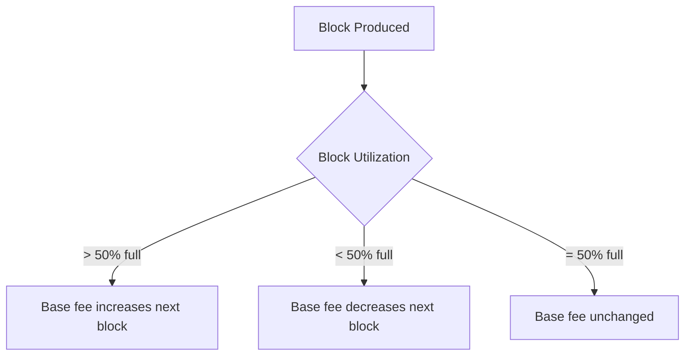
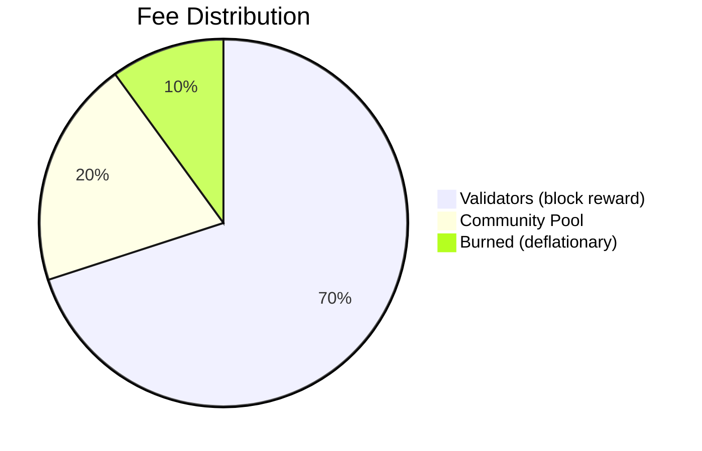

# Fee Model

**LalaChain uses an EIP-1559-inspired dynamic fee mechanism where the base fee adjusts automatically based on block utilization, with AI oversight for long-term optimization.**

---

## How Fees Work

Every transaction on LalaChain requires a fee paid in ulala:

```
Transaction Fee = Gas Used × Base Fee Per Gas
```

The **base fee** is not static — it changes every block based on how full the previous block was.

---

## Dynamic Base Fee (EIP-1559 Style)



The mechanism targets 50% block utilization:
- **Block more than half full** → base fee goes up (discouraging demand)
- **Block less than half full** → base fee goes down (encouraging demand)
- This creates a self-regulating market for block space

### Fee Decay Formula

When blocks are underutilized, the base fee decays:

```
newBaseFee = currentBaseFee × 7 / (7 + decayFactor)
```

Where `decayFactor = 1` during low-utilization periods. This produces a smooth exponential decay rather than sudden drops.

---

## Fee Parameters

| Parameter | Value | Description |
|-----------|-------|-------------|
| Base fee (initial) | 1,000,000,000 ulala/gas | Starting fee per unit of gas |
| Min fee (hard floor) | 100,000,000 ulala/gas | Absolute minimum, prevents zero-fee spam |
| Max fee (hard ceiling) | 10,000,000,000 ulala/gas | Absolute maximum |
| AI min target | 800,000,000 ulala/gas | Below this, AI considers fees "too low" |
| AI max target | 5,000,000,000 ulala/gas | Above this, AI considers fees "too high" |
| Target utilization | 50% | The "Goldilocks" utilization level |

---

## Fee Scenarios

### Normal Operation

```
Block 50% full → Base fee stable → Fees predictable
```

Users pay moderate, stable fees. The fee market is in equilibrium.

### Demand Spike

```
Blocks 90% full → Base fee rising → Expensive transactions
↓
AI detects highStreak ≥ 2 → Proposes gas limit reduction
↓
If approved: Less block space → Higher fees → Spam priced out
```

### Quiet Period

```
Blocks 20% full → Base fee falling → Cheap transactions
↓  
Fee drops below 800M (MinFeeTarget)
↓
AI detects lowStreak ≥ 3 → Proposes gas limit increase + fee bump
↓
If approved: More capacity + sustainable fee level
```

---

## AI Oversight Layer

The dynamic fee mechanism handles block-to-block adjustments. The AI Advisor handles **epoch-scale** optimization:

| Time Scale | Mechanism | Adjusts |
|-----------|-----------|---------|
| Per-block | EIP-1559 formula | Base fee (small increments) |
| Per-epoch (~50s) | AI rule evaluation | Gas limit, fee targets |

This two-layer approach means:
- Short-term fluctuations are handled automatically
- Long-term trends are addressed by AI proposals with validator oversight

---

## Fee Distribution

When a user pays a transaction fee:



- **70%** goes to the block proposer and is shared with delegators
- **20%** goes to the community pool (controlled by governance)
- **10%** is burned (removed from circulation permanently)

---

## Comparison to Other Chains

| Chain | Fee Model | Predictability | Adaptability |
|-------|-----------|---------------|--------------|
| Bitcoin | First-price auction | Poor (bidding wars) | None |
| Ethereum | EIP-1559 base fee | Good | Slow (manual EIPs) |
| Solana | Fixed + priority | Good | None |
| **LalaChain** | **EIP-1559 + AI governance** | **Good** | **Fast (epoch-scale)** |

---

## User Tips

1. **Check the current base fee** before submitting transactions:
   ```
   GET /lala/telemetry/v1/kpis
   ```

2. **Set appropriate gas limits** — too low and your tx fails; too high and you overpay

3. **During high fees, wait** — the AI will likely propose a correction within a few epochs

4. **Fees are in ulala** — divide by 1,000,000 to get LALA
