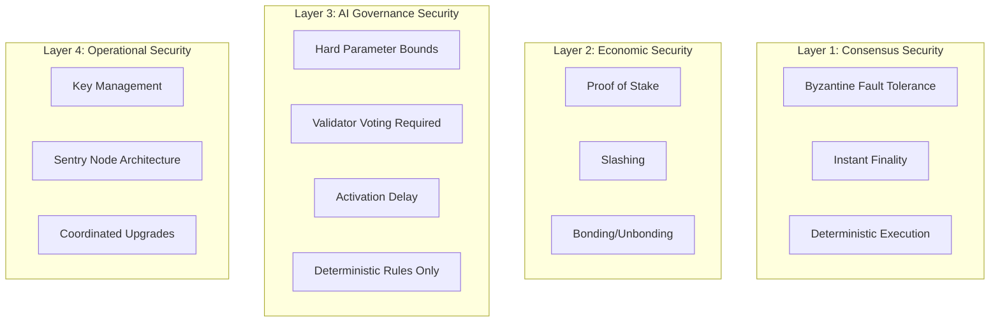

---
title: "Security Model"
description: "Security guarantees from BFT consensus, staking, and slashing."
---

# Security Model

**LalaChain's security rests on four pillars: cryptographic consensus, economic staking, bounded AI governance, and defense-in-depth parameter limits.**

---

## Security Architecture



---

## Pillar 1: Consensus Security

### Byzantine Fault Tolerance
- Network tolerates up to **1/3 malicious validators** by voting power
- Requires **2/3+ agreement** to produce blocks
- No single point of failure

### Instant Finality
- Once committed, blocks are **irreversible**
- No chain reorganizations possible
- No "51% attacks" (would need 2/3 of stake)

### Deterministic Execution
- Same transactions always produce same state
- All validators independently verify state transitions
- Any discrepancy is immediately detected

---

## Pillar 2: Economic Security

### Proof of Stake
- Validators must lock LALA tokens as collateral
- **Cost of attack** = acquiring 2/3 of total staked tokens
- Rational validators protect their investment

### Slashing
Validators are punished for misbehavior:

| Offense | Penalty |
|---------|---------|
| Double-signing | 5% stake slashed + permanent jail |
| Extended downtime (>95% missed blocks) | 0.01% stake slashed + temporary jail |
| Governance inactivity | No direct penalty (reputation damage) |

### Unbonding Period
- Unstaking takes 21 days
- During this period, tokens can still be slashed
- Prevents "stake and run" attacks

---

## Pillar 3: AI Governance Security

The AI Advisor introduces novel attack surfaces. Here's how they're mitigated:

### Hard Parameter Bounds

The AI can NEVER propose values outside absolute limits:

| Parameter | Min | Max | Max Single Change |
|-----------|-----|-----|------------------|
| block_gas_limit | 10M | 30M | ±5% |
| base_fee_per_gas | 100M | 10B | ±10% |
| target_block_time_ms | 1,000 | 20,000 | ±10% |

Even a compromised AI module cannot suggest catastrophic values.

### Validator Voting Required

- The AI can **propose**, never **execute**
- 66% quorum required for vote to be valid
- 51% approval threshold
- Validators can always vote NO

### Activation Delay

- 2 epochs (~100 seconds) between approval and activation
- Emergency cancellation possible during delay
- Gives ecosystem time to react to suspicious proposals

### Deterministic Rules

- No ML models, no neural networks, no external data feeds
- Rule engine is auditable Go code running on-chain
- Every validator computes the same result independently
- Proposals include full evidence (KPI data, streak values)

---

## Pillar 4: Operational Security

### Key Management
- Validator consensus keys: Ed25519
- Account keys: secp256k1
- Support for hardware security modules (HSM)
- KMS (Key Management Service) integration

### Sentry Node Architecture
```
[Internet] → [Sentry Node 1] → [Validator]
           → [Sentry Node 2] ↗
```
- Validators hidden behind sentry nodes
- DDoS attacks target sentries, not the validator
- Private validator ID never exposed publicly

### Coordinated Upgrades
- Software upgrades via governance proposal
- Binary swap at coordinated block height
- Automatic halt if upgrade not applied

---

## Threat Model

| Threat | Mitigation | Residual Risk |
|--------|-----------|---------------|
| Validator collusion (>2/3) | Economic cost, stake distribution | Very low (requires billions) |
| AI manipulation | Deterministic rules, validator oversight | Low |
| Network partition | BFT halts rather than forks | Liveness loss, not safety |
| Key compromise | HSM, KMS, sentry architecture | Per-validator risk |
| Spam/DDoS | Gas fees, mempool limits | Temporary degradation |
| Smart contract bugs | Audit requirement, limited contract scope | Application-layer risk |
| Governance capture | Quorum requirements, activation delay | Medium (long-term risk) |

---

## Security Assumptions

LalaChain's security holds under these assumptions:

1. **<1/3 of stake is malicious** — BFT threshold
2. **Validators act rationally** — economic incentives align with honest behavior
3. **Cryptographic primitives are secure** — no breaks in Ed25519/secp256k1/SHA-256
4. **Network eventually delivers messages** — partial synchrony assumption
5. **AI rules are correctly implemented** — code audit verifies rule logic

---

## Security Auditing

- All custom modules undergo security audit before mainnet
- Rule engine logic is formally specified and tested
- Continuous monitoring for anomalous validator behavior
- Bug bounty program for responsible disclosure

