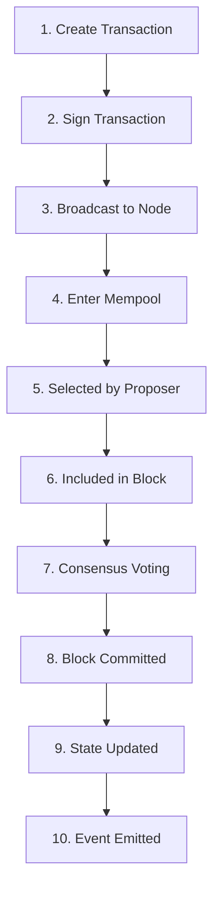

# Transaction Lifecycle

**Every transaction on LalaChain follows a deterministic path from creation to permanent inclusion in the blockchain.**

---

## Complete Lifecycle



---

## Step-by-Step

### 1. Create Transaction

The user (or application) constructs a transaction message:

```json
{
  "body": {
    "messages": [{
      "@type": "/cosmos.bank.v1beta1.MsgSend",
      "from_address": "lala1abc...",
      "to_address": "lala1xyz...",
      "amount": [{"denom": "ulala", "amount": "1000000"}]
    }],
    "memo": "Payment for services"
  },
  "auth_info": {
    "fee": {
      "amount": [{"denom": "ulala", "amount": "5000"}],
      "gas_limit": "200000"
    }
  }
}
```

### 2. Sign Transaction

The wallet signs the transaction with the sender's private key:
- Proves the sender authorized this specific transaction
- Includes account sequence number (prevents replay)
- Uses secp256k1 or ed25519 cryptography

### 3. Broadcast to Node

The signed transaction is sent to any LalaChain node via:
- REST API: `POST /cosmos/tx/v1beta1/txs`
- RPC: `broadcast_tx_sync` or `broadcast_tx_async`
- CLI: `lalachaind tx broadcast`

### 4. Enter Mempool

The receiving node performs **CheckTx** validation:
- ✅ Signature is valid
- ✅ Account exists and has sufficient balance
- ✅ Gas limit is reasonable
- ✅ Sequence number is correct (next expected)
- ✅ Fee meets minimum gas price

If validation passes, the transaction enters the **mempool** (waiting area) and is gossiped to other nodes.

### 5. Selected by Proposer

When a validator is chosen to propose the next block, it:
- Pulls transactions from the mempool
- Orders them (typically by fee, highest first)
- Fills the block up to the gas limit
- Constructs the block header

### 6. Included in Block

The transaction is now part of a candidate block with:
- Block header (height, timestamp, previous block hash)
- All included transactions
- Proposer's signature

### 7. Consensus Voting

All validators receive the proposed block and:
1. Re-execute all transactions (**DeliverTx**)
2. Verify the resulting state hash matches
3. Pre-vote → Pre-commit → Commit (see [Consensus](consensus.md))

### 8. Block Committed

With 2/3+ agreement, the block is finalized:
- Block is appended to the chain
- State changes are persisted
- Block height increments

### 9. State Updated

The transaction's effects are applied:
- Sender balance decremented
- Recipient balance incremented
- Fee collected by validators
- Account sequence number incremented

### 10. Event Emitted

The transaction emits events that clients can subscribe to:
```
transfer: sender=lala1abc, recipient=lala1xyz, amount=1000000ulala
message: action=/cosmos.bank.v1beta1.MsgSend, sender=lala1abc
```

---

## Timing

| Phase | Duration |
|-------|----------|
| Create + Sign | Instant (client-side) |
| Broadcast + Mempool | < 1 second |
| Block inclusion | 0-5 seconds (next block) |
| Consensus | < 1 second |
| **Total** | **~5-10 seconds** |

---

## Failure Modes

| Failure | When | Consequence |
|---------|------|-------------|
| Insufficient balance | CheckTx | Rejected immediately, no fee charged |
| Invalid signature | CheckTx | Rejected immediately |
| Out of gas | DeliverTx | Transaction fails, gas fee still charged |
| Sequence mismatch | CheckTx | Rejected — resend with correct sequence |
| Mempool full | Broadcast | Rejected — retry later or increase fee |

---

## Transaction Fees

LalaChain uses EIP-1559-style dynamic fees:

```
Required Fee ≥ Gas Used × Current Base Fee
```

- **Base fee** adjusts per-block based on utilization
- **Tip** (optional) can be added to prioritize inclusion
- Fees are paid in `ulala`

The AI Advisor monitors fee trends and can propose adjustments if fees drift outside healthy bounds.
