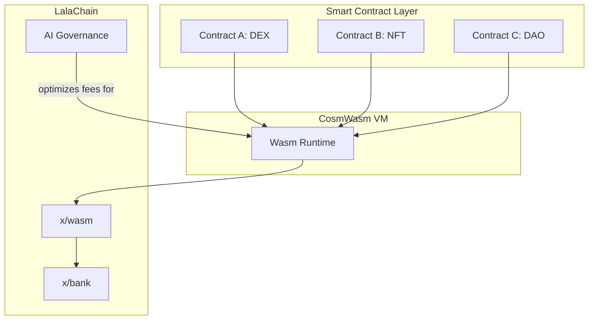

# Smart Contracts: Overview

**LalaChain supports CosmWasm smart contracts — WebAssembly-based contracts written in Rust that run in a sandboxed environment.**

---

## What is CosmWasm?

CosmWasm is the smart contract platform for Cosmos SDK chains. It allows developers to deploy custom logic that executes on-chain, similar to Solidity on Ethereum but with:

- **Rust** as the programming language (memory-safe, high-performance)
- **WebAssembly** (Wasm) as the execution target (sandboxed, portable)
- **Actor model** for contract interactions (no reentrancy bugs by design)

---

## Why Smart Contracts on LalaChain?

While LalaChain's core governance is handled by native modules, smart contracts enable:

- **DeFi protocols** — DEXs, lending, stablecoins
- **NFTs** — Collectibles, gaming assets, certificates
- **DAOs** — Custom governance for organizations
- **Custom logic** — Any programmable on-chain behavior

All smart contracts benefit from LalaChain's self-optimizing fees and capacity.

---

## Architecture

---

## Key Concepts

| Concept | Description |
|---------|-------------|
| **Instantiate** | Deploy a new contract instance with initial state |
| **Execute** | Call a contract function that modifies state |
| **Query** | Read contract state without modifying it (free) |
| **Migrate** | Upgrade contract code (if admin is set) |

---

## Contract Lifecycle

1. **Upload** — Store compiled Wasm bytecode on-chain (code ID)
2. **Instantiate** — Create a contract instance from uploaded code
3. **Execute** — Users interact with the contract
4. **Query** — Read contract state
5. **Migrate** — (Optional) Upgrade to new code

---

## Smart Contract + AI Governance

Smart contracts on LalaChain benefit from AI-managed parameters:
- **Fee stability** — Contract interactions have predictable costs
- **Capacity scaling** — Gas limits adjust to accommodate contract activity
- **No manual intervention** — The chain adapts to contract usage patterns

---

## Getting Started

1. [Setup](setup.md) — Install Rust and CosmWasm tools
2. [First Contract](first-contract.md) — Build and deploy "Hello World"
3. [Testing](testing.md) — Test contracts locally
4. [Security](security-best-practices.md) — Avoid common vulnerabilities
5. [Examples](examples.md) — Real-world contract patterns
