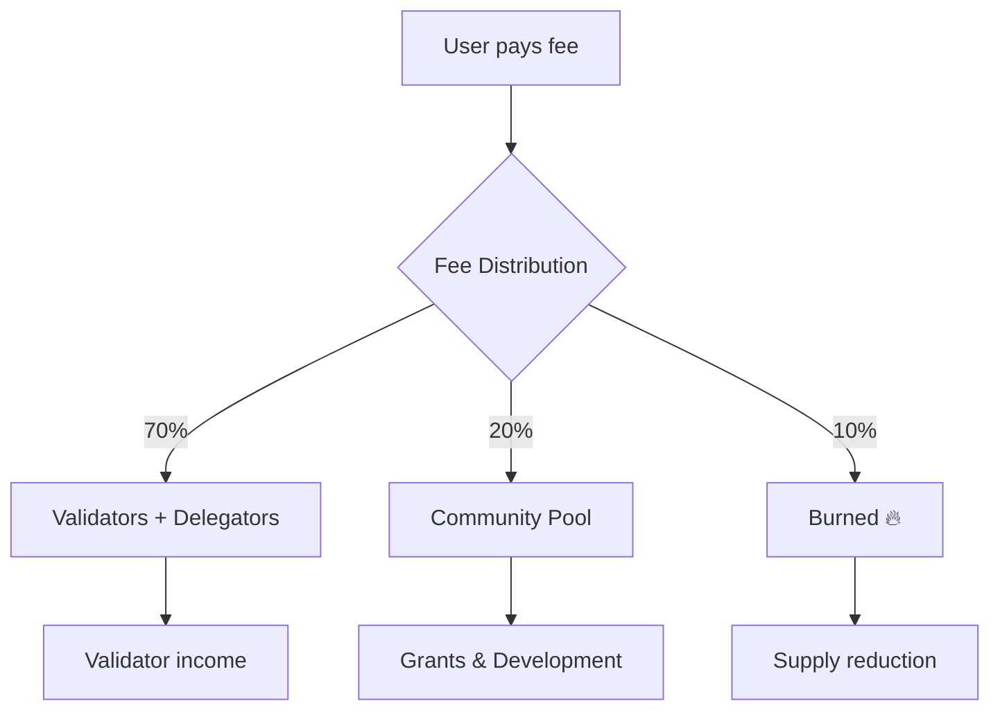
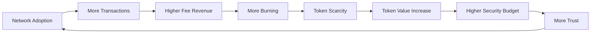

# Fee Economics

**Transaction fees on LalaChain create a sustainable economic cycle: users pay for block space, validators earn income, and token burning creates deflationary pressure.**

---

## Fee Flow



---

## Fee Components

Every transaction fee has two parts:

```
Total Fee = Gas Used × (Base Fee + Priority Tip)
```

| Component | Description | Goes To |
|-----------|-------------|---------|
| Base fee | Dynamic, protocol-set minimum | Partially burned |
| Priority tip | Optional, user-set extra | Block proposer |

---

## Fee Sustainability Model

LalaChain's fee system is designed to be self-sustaining:

### Revenue Side (Validators)
- Transaction fees provide income regardless of inflation
- As adoption grows, fee revenue grows
- AI optimization keeps fees in a "healthy band" — not too high (users leave) nor too low (validators unprofitable)

### Cost Side (Users)
- Dynamic fees mean users pay market rates
- AI prevents fee spikes from persisting
- Low-activity periods have low fees (network isn't punishing during quiet times)

### Deflationary Side (Token Holders)
- 10% burn creates buy pressure
- High transaction volume = significant burn rate
- Can offset or exceed inflation at scale

---

## Fee Revenue Projections

| Daily Transactions | Avg Fee (ulala) | Daily Fee Revenue | Annual Fee Revenue | Annual Burn |
|-------------------|-----------------|-------------------|-------------------|-------------|
| 10,000 | 100,000 | 1B ulala (1K LALA) | 365K LALA | 36.5K LALA |
| 100,000 | 100,000 | 10B ulala (10K LALA) | 3.65M LALA | 365K LALA |
| 1,000,000 | 100,000 | 100B ulala (100K LALA) | 36.5M LALA | 3.65M LALA |
| 10,000,000 | 100,000 | 1T ulala (1M LALA) | 365M LALA | 36.5M LALA |

At 10M daily transactions, the burn rate (36.5M LALA/year) would significantly offset inflation (~130M LALA/year at 67% staking).

---

## AI Impact on Fee Economics

The AI Advisor's fee management has economic consequences:

### Scenario: Fees Too Low
1. Base fee drops below 800M ulala/gas
2. Validator revenue decreases
3. AI proposes fee increase (+5%)
4. If approved: validators earn more, burn rate increases

### Scenario: Fees Too High
1. Base fee exceeds 5B ulala/gas
2. Users are priced out, transaction volume drops
3. AI proposes fee decrease (-10%)
4. If approved: users return, volume recovers, total revenue may actually increase

The AI acts as an **economic stabilizer** — preventing the death spirals that occur when fees are either too high (users leave) or too low (validators leave).

---

## Community Pool

20% of fees flow to the community pool, governed by token holders:

**Uses:**
- Developer grants
- Security audits
- Marketing and ecosystem growth
- Infrastructure funding
- Bug bounties

**Governance:**
- Spending requires on-chain proposal + vote
- Any token holder can propose spending
- Prevents centralized control of funds

---

## Long-term Economic Model



This creates a **virtuous cycle** where:
- More users → more fees → more burning → scarcer token → higher value → attracts more validators → better security → attracts more users

---

**Next:** [Governance Power](governance-power.md)
