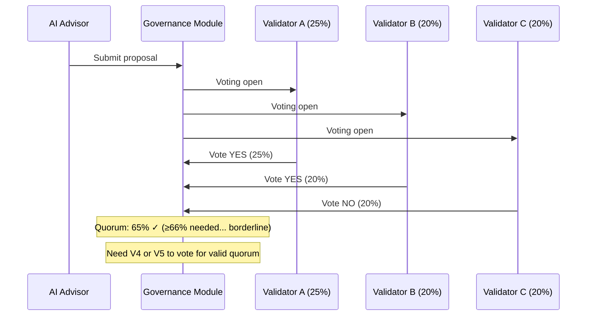

---
title: "Governance Power"
description: "How staked tokens translate to voting power in governance."
---

# Governance Power

**On LalaChain, staked tokens translate directly into governance power — the ability to approve or reject AI-proposed parameter changes.**

---

## How Governance Power Works

```
Governance Power = Staked LALA (self-bond + received delegations)
```

Only **validators** currently vote on AI proposals. Their voting power equals their total stake (self-bond + all delegations).

| Validator | Self-Bond | Delegations | Total Stake | Voting Power |
|-----------|-----------|-------------|-------------|--------------|
| Validator A | 1M LALA | 4M LALA | 5M LALA | 25% |
| Validator B | 2M LALA | 2M LALA | 4M LALA | 20% |
| Validator C | 500K LALA | 3.5M LALA | 4M LALA | 20% |
| Validator D | 1M LALA | 2M LALA | 3M LALA | 15% |
| Validator E | 1M LALA | 3M LALA | 4M LALA | 20% |
| **Total** | | | **20M LALA** | **100%** |

---

## Voting Mechanics

### Quorum
At least **66% of total voting power** must participate for a vote to be valid.

In the example above: 66% of 20M = 13.2M LALA worth of validators must vote.

### Approval Threshold
Of votes cast, **51% must be "Yes"** for a proposal to pass.

### Vote Options
- **Yes** — Approve the proposal
- **No** — Reject the proposal
- **Abstain** — Count toward quorum but not toward Yes/No ratio

---

## Governance Flow



---

## Delegation and Governance

When you delegate to a validator, you're entrusting them with:
1. **Block production** — Using your stake to secure the network
2. **Governance voting** — Voting on AI proposals with your stake's weight

**Important:** Currently, only validators vote. Delegators cannot override their validator's vote. Choose validators whose governance philosophy aligns with yours.

### Future: Delegator Voting

Planned upgrades may allow delegators to:
- Override their validator's vote on specific proposals
- Split voting power among multiple positions
- Delegate governance power separately from staking

---

## Power Concentration Risks

### The Problem
If one validator accumulates >34% of stake, they can block any proposal (preventing quorum). If they get >51%, they can pass anything alone.

### Mitigations

| Mechanism | How It Helps |
|-----------|-------------|
| Commission competition | High-commission validators lose delegators |
| Slashing risk | Large validators are juicy targets for attackers |
| Dashboard warnings | UI warns when delegating to over-concentrated validators |
| Foundation delegation | Foundation spreads delegation to maintain decentralization |
| Validator cap (future) | Maximum percentage per validator |

---

## Governance Participation Incentives

### Why Validators Should Vote

1. **Reputation** — Active governance participation attracts delegators
2. **Self-interest** — Parameter changes affect validator profitability
3. **Network health** — Well-governed chains retain users and value
4. **Future penalties** — Governance inactivity may eventually lead to penalties

### Why Delegators Should Care

1. **Your stake votes through your validator** — you're responsible for who you delegate to
2. **Parameter changes affect your returns** — fee and gas limit changes impact staking APR
3. **AI proposals are frequent** — unlike traditional governance (monthly), LalaChain has proposals every few epochs

---

## Governance Power vs. Other Chains

| Chain | Who Votes | Power Source | Frequency |
|-------|-----------|-------------|-----------|
| Ethereum | No on-chain governance | N/A | N/A (off-chain EIPs) |
| Cosmos Hub | All stakers | Staked ATOM | ~Monthly |
| Polkadot | All holders (conviction) | DOT × lock time | Weekly |
| **LalaChain** | **Validators** | **Staked LALA** | **Every epoch (~50s)** |

LalaChain's high governance frequency means validators must be actively engaged — this isn't a "vote once a month" chain.

