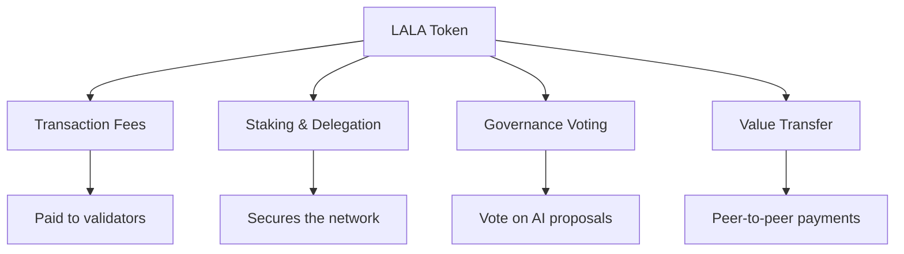

# LALA Token

**LALA is the native token of LalaChain — used for transaction fees, staking, governance participation, and value transfer.**

---

## Token Overview

| Property | Value |
|----------|-------|
| Name | LALA |
| Ticker | LALA |
| Smallest unit | ulala (micro-LALA) |
| Decimals | 6 (1 LALA = 1,000,000 ulala) |
| Type | Native L1 coin |
| Address prefix | `lala1` |

---

## Token Uses

### 1. Transaction Fees
Every transaction requires a fee in ulala. Fees compensate validators for processing transactions and prevent network spam.

### 2. Staking & Delegation
Validators stake LALA to participate in consensus. Token holders delegate LALA to validators to earn a share of rewards without running infrastructure.

### 3. Governance
Staked LALA grants voting power on AI Advisor proposals. More stake = more voting weight. This ensures those with the most to lose have the most say.

### 4. Value Transfer
LALA can be sent between any addresses on the network, used as payment, or bridged to other Cosmos chains via IBC.

---

## Token Economics Summary

| Metric | Value |
|--------|-------|
| Initial supply | 1,000,000,000 LALA (1 billion) |
| Inflation rate | 7-20% annually (adjustable) |
| Target staking ratio | 67% of supply staked |
| Fee burn rate | 10% of fees burned |
| Community pool | 20% of fees |
| Validator rewards | 70% of fees + inflation |

---

## Why Hold LALA?

1. **Earn staking rewards** — 7-20% APR for delegating to validators
2. **Participate in governance** — Vote on how the chain evolves
3. **Use applications** — Pay fees for DeFi, NFTs, and other dApps
4. **Deflationary pressure** — Fee burning reduces supply over time
5. **Network effects** — As LalaChain grows, demand for LALA increases

---

## Token Mechanics

### Inflation
New LALA is minted each block as staking rewards. The inflation rate adjusts based on the staking ratio:
- If <67% of tokens are staked → inflation increases (incentivizing staking)
- If >67% of tokens are staked → inflation decreases (encouraging liquidity)

### Burning
10% of all transaction fees are permanently burned (removed from supply). Over time, if transaction volume is high enough, burning can offset inflation, making LALA deflationary.

### Slashing
Misbehaving validators lose staked LALA (slashing). Slashed tokens are partially burned, partially sent to the community pool.

---

**Next:** [Supply & Distribution](supply-and-distribution.md)
