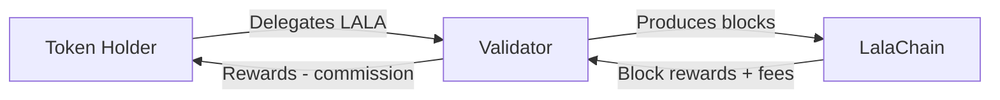

# Staking Economics

**Staking LALA tokens secures the network and earns rewards. Here's how the economics work for validators and delegators.**

---

## How Staking Works



1. **Validators** stake their own LALA (self-bond) and accept delegations
2. **Delegators** bond LALA to a validator of their choice
3. Both earn rewards proportional to their stake
4. Validators take a **commission** on delegator rewards

---

## Reward Sources

| Source | Description | Amount |
|--------|-------------|--------|
| Block inflation | New LALA minted per block | Variable (7-20% annual) |
| Transaction fees | Fees from processed transactions | Depends on network activity |
| MEV (future) | Maximal extractable value | Not yet implemented |

### Annual Staking Yield (APR)

At target staking ratio (67%):

```
Staking APR ≈ (Inflation Rate / Staking Ratio) + Fee Revenue
           ≈ (13% / 67%) + ~2%
           ≈ 19.4% + 2%
           ≈ ~21% APR
```

*Actual yields vary based on network conditions, validator commission, and fee volume.*

---

## Validator Economics

### Revenue
- Block rewards (proportional to voting power)
- Transaction fees from proposed blocks
- Commission on delegator rewards (5-20% typical)

### Costs
- Hardware: ~$200-500/month (cloud) or $2,000-5,000 one-time (bare metal)
- Bandwidth: ~$50-100/month
- Monitoring and maintenance: Engineering time
- Self-bond opportunity cost

### Commission
Validators set a commission rate (percentage of delegator rewards they keep):

| Commission | Validator Keeps | Delegator Gets |
|-----------|----------------|----------------|
| 5% | 5% of delegation rewards | 95% |
| 10% | 10% of delegation rewards | 90% |
| 20% | 20% of delegation rewards | 80% |

---

## Delegator Economics

### Revenue
- Share of validator's rewards minus commission
- Proportional to delegation amount

### Costs
- Zero hardware costs
- Zero operational overhead
- Only risk: slashing if validator misbehaves

### Example Calculation

```
Delegation: 10,000 LALA
Network APR: 21%
Validator Commission: 10%

Annual Reward = 10,000 × 21% × (1 - 10%)
             = 10,000 × 0.21 × 0.90
             = 1,890 LALA/year
             ≈ 5.18 LALA/day
```

---

## Unbonding

When you unstake (undelegate) tokens:

| Parameter | Value |
|-----------|-------|
| Unbonding period | 21 days |
| Rewards during unbonding | None |
| Slashable during unbonding | Yes |
| Redelegation | Instant (once per validator pair per 21 days) |

The 21-day unbonding period:
- Prevents "stake and run" attacks
- Ensures security even if many unstake simultaneously
- Allows slashing to catch up to misbehavior

---

## Slashing

Delegators share the risk with their validator:

| Offense | Slash Rate | Jail Duration |
|---------|-----------|---------------|
| Double signing | 5% of stake | Permanent (tombstoned) |
| Downtime (>95% missed) | 0.01% of stake | 10 minutes |

**Both validator self-bond AND delegator bonds are slashed.** Choose validators carefully.

---

## Choosing a Validator

| Factor | Why It Matters |
|--------|---------------|
| **Uptime** | High uptime = no slashing, consistent rewards |
| **Commission** | Lower = more rewards for you |
| **Self-bond** | High self-bond = validator has skin in the game |
| **Governance participation** | Active voters maintain network health |
| **AI proposal voting** | Informed voters produce better parameter governance |
| **Reputation** | Established operators are less likely to misbehave |

---

## Staking Strategies

### Conservative
- Delegate to top 5 validators by uptime
- 10-15% commission acceptable
- Compound rewards monthly

### Balanced
- Split across 3-5 validators (diversification)
- Mix of high-uptime and lower-commission validators
- Compound rewards weekly

### Active
- Monitor validator performance closely
- Redelegate away from underperforming validators
- Seek lowest commission with acceptable uptime
- Compound rewards daily

---

**Next:** [Fee Economics](fee-economics.md)
