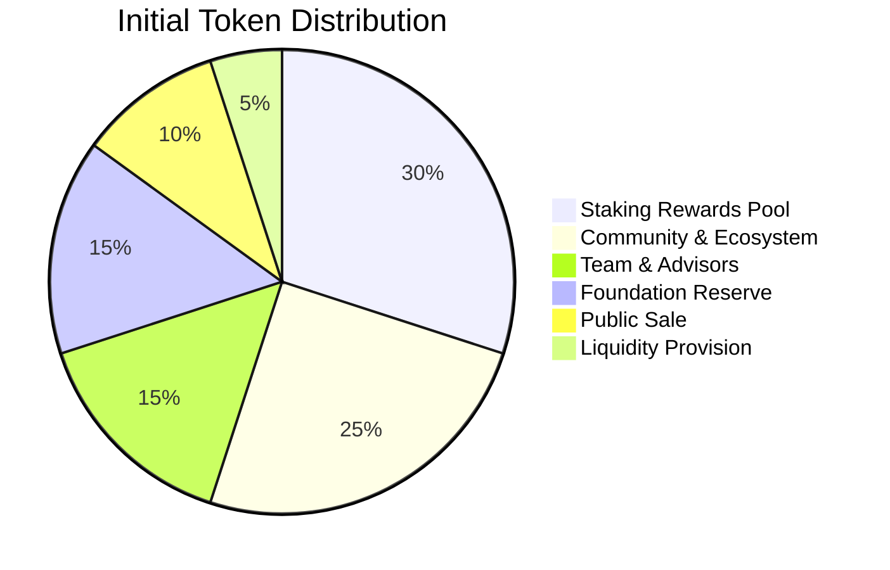

# Supply & Distribution

**LalaChain launches with 1 billion LALA tokens distributed across ecosystem participants, with ongoing inflation for staking rewards.**

---

## Genesis Distribution



| Allocation | Percentage | Amount | Vesting |
|-----------|-----------|--------|---------|
| Staking Rewards Pool | 30% | 300M LALA | Released via inflation over 10 years |
| Community & Ecosystem | 25% | 250M LALA | Grants, partnerships, airdrops |
| Team & Advisors | 15% | 150M LALA | 4-year vesting, 1-year cliff |
| Foundation Reserve | 15% | 150M LALA | Governed by multisig, long-term development |
| Public Sale | 10% | 100M LALA | No lockup |
| Liquidity Provision | 5% | 50M LALA | DEX pairs, market making |

---

## Vesting Schedules

### Team & Advisors (15%)
- **Cliff:** 12 months (no tokens released)
- **Vesting:** Linear over 48 months after cliff
- **Full unlock:** 5 years from genesis

### Foundation Reserve (15%)
- **Governance-controlled:** Requires on-chain proposal + vote to release
- **Intended use:** Protocol development, security audits, partnerships
- **Maximum annual release:** 20% of remaining reserve

### Community & Ecosystem (25%)
- **Grants:** Released on milestone completion
- **Airdrops:** Distributed to early adopters and testnet participants
- **Ecosystem fund:** Supports builders and integrators

---

## Supply Dynamics

### Inflation (Minting)

New tokens are created each block as staking rewards:

| Staking Ratio | Inflation Rate | Annual New Supply |
|---------------|---------------|-------------------|
| <50% | 20% | ~200M LALA |
| 67% (target) | 13% | ~130M LALA |
| >80% | 7% | ~70M LALA |

The inflation mechanism incentivizes staking:
- Too few stakers → high rewards attract more staking
- Too many stakers → low rewards encourage liquidity

### Deflation (Burning)

Tokens are removed from circulation:

| Burn Source | Rate |
|------------|------|
| Transaction fee burn | 10% of all fees |
| Slashing burn | Portion of slashed stake |
| Governance burn | If voted by community |

---

## Supply Projection (10 Years)

| Year | Circulating Supply | Staking Rewards Paid | Tokens Burned (est.) | Net Supply |
|------|-------------------|---------------------|---------------------|-----------|
| 0 | 1.0B | 0 | 0 | 1.0B |
| 1 | 1.0B | 130M | 5M | 1.125B |
| 2 | 1.125B | 146M | 8M | 1.263B |
| 3 | 1.263B | 164M | 12M | 1.415B |
| 5 | ~1.6B | ~180M/yr | ~20M/yr | ~1.76B |
| 10 | ~2.2B | ~150M/yr | ~40M/yr | ~2.3B |

*Estimates assume 67% staking ratio and growing transaction volume.*

---

## Circulating vs. Total Supply

- **Total Supply:** All tokens that exist (minted - burned)
- **Circulating Supply:** Tokens available for trading (total - staked - vesting - locked)
- **Staked Supply:** Tokens locked in staking (illiquid but earning rewards)

At target staking ratio (67%):
```
Circulating ≈ 33% of total supply
Staked ≈ 67% of total supply
```

---

## Anti-Concentration Measures

- **Vesting for insiders** — Team/advisors can't dump at launch
- **Broad public distribution** — Airdrops + public sale to maximize decentralization
- **Delegation diversity** — UI warns users about over-concentrated validators
- **Quadratic considerations** — Future governance may weight votes sublinearly
