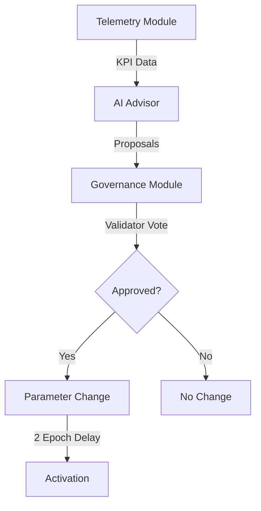
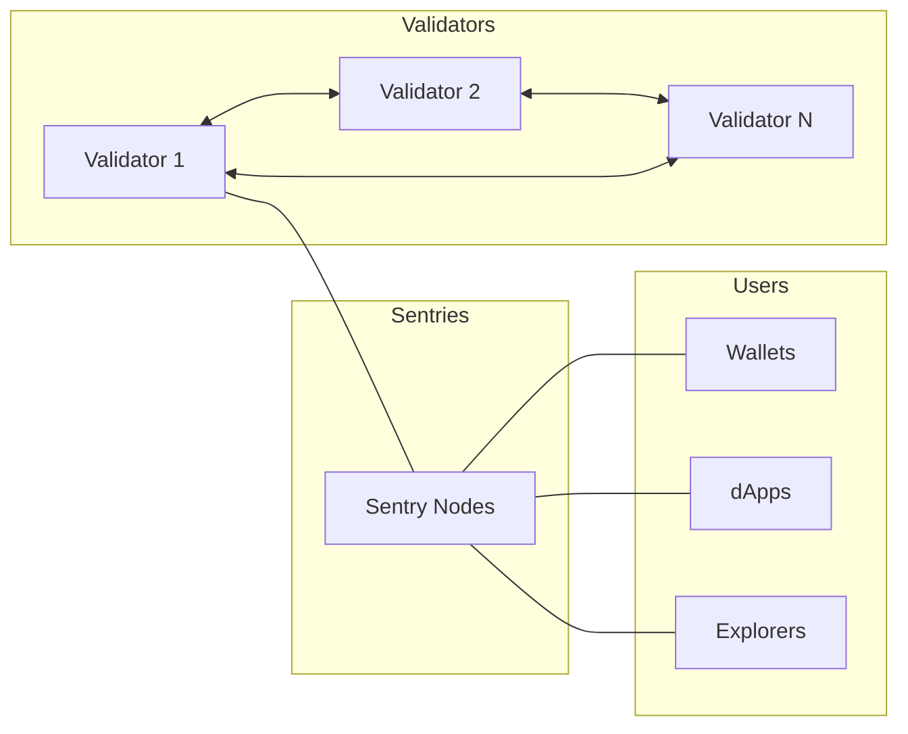

# LalaChain Protocol — Whitepaper Summary

**An Executive Summary of the LalaChain Protocol Design**

*Version 1.0 — 2024*

---

## 1. Abstract

LalaChain is a Layer 1 proof-of-stake blockchain that integrates a deterministic AI Advisor into its governance loop. Built on the Cosmos SDK and CometBFT consensus, LalaChain autonomously monitors network performance metrics and proposes parameter adjustments—subject to validator approval—to maintain optimal throughput, fair fees, and network health without requiring constant human intervention.

---

## 2. Problem Statement

Modern blockchains face a governance paradox:

- **Static parameters degrade over time** — A gas limit set at launch becomes suboptimal as usage patterns change
- **Manual governance is slow** — Parameter change proposals take days to weeks, while network conditions change in minutes
- **Voter apathy is endemic** — Most token holders never participate in governance
- **Technical expertise is required** — Understanding optimal parameter values requires deep protocol knowledge

The result: most chains operate with suboptimal parameters for extended periods, leading to either congestion (parameters too restrictive) or wasted capacity (parameters too permissive).

---

## 3. Solution: AI-Assisted Governance

LalaChain introduces a three-layer governance architecture:



### Layer 1: Observation (Telemetry Module)
Tracks per-epoch metrics:
- Block gas utilization (%)
- Base fee per gas
- Low/high utilization streaks
- Total fees collected

### Layer 2: Analysis (AI Advisor Module)
Four deterministic rules evaluate KPIs:

| Rule | Trigger | Action |
|------|---------|--------|
| R1 | lowStreak ≥ 3 AND fee < minTarget | +5% gas limit |
| R2 | highStreak ≥ 2 | -5% gas limit |
| R3 | fee > maxTarget | -10% fee |
| R4 | fee < minTarget | +5% fee |

### Layer 3: Decision (Governance Module)
- Proposals require 66% quorum and 51% approval
- Voting period: 1 epoch (~50 seconds)
- Activation delay: 2 epochs after approval
- All votes recorded on-chain permanently

---

## 4. Technical Architecture

### Consensus
- **Engine:** CometBFT (Tendermint Core)
- **Finality:** Instant (single block)
- **Block Time:** ~5 seconds target
- **BFT Tolerance:** Up to 1/3 malicious validators

### Token Economics
- **Token:** LALA (smallest unit: ulala, 1 LALA = 1,000,000 ulala)
- **Uses:** Gas fees, staking, governance
- **Staking:** Delegated Proof-of-Stake with unbonding period

### Fee Model
EIP-1559-inspired dynamic fees:
```
effectiveFee = baseFee * 7 / (7 + decayFactor)
```
- Adjusts per epoch based on utilization
- Hard bounds: 100M–10B ulala per gas unit
- AI proposes adjustments when fees drift outside target range

### Parameter Bounds

| Parameter | Minimum | Maximum | Max Change/Epoch |
|-----------|---------|---------|-----------------|
| block_gas_limit | 10,000,000 | 30,000,000 | ±5% |
| base_fee_per_gas | 100,000,000 | 10,000,000,000 | ±10% |
| target_block_time_ms | 1,000 | 20,000 | Governance only |

---

## 5. Safety Guarantees

The AI Advisor is designed with multiple safety layers:

1. **Cannot execute** — Only proposes; validators must approve
2. **Bounded magnitude** — Maximum ±5-10% change per proposal
3. **Bounded range** — Hard minimum/maximum for all parameters
4. **Deterministic** — Same inputs always produce same outputs; no learning or adaptation
5. **Transparent** — Every decision includes full evidence chain
6. **Reversible** — Any change can be reversed in the next epoch
7. **Delay-gated** — 2-epoch activation delay provides reaction time

### Worst-Case Scenario
Even if the AI consistently proposes bad changes AND validators approve them all:
- Parameters drift at most 5-10% per epoch
- Hard bounds eventually stop the drift
- Manual governance can override at any time
- No user funds are ever at risk from parameter changes

---

## 6. Network Topology



- Validators connect to each other and to sentry nodes
- Users connect through sentry/full nodes
- No direct public access to validators

---

## 7. Governance Philosophy

LalaChain's governance combines three principles:

1. **Automation for routine decisions** — The AI handles parameter tuning that humans neglect
2. **Human oversight for all changes** — Validators approve or reject every proposal
3. **Transparency for accountability** — All decisions, votes, and reasoning are permanently on-chain

This creates a system where:
- Parameters stay optimized (AI monitors continuously)
- No single entity controls the chain (decentralized voting)
- Bad decisions are bounded and reversible (safety constraints)
- The system improves over time (governance can update AI configuration)

---

## 8. Comparison to Existing Approaches

| Aspect | Traditional Governance | LalaChain |
|--------|----------------------|-----------|
| Response time | Days to weeks | 1-3 epochs (~2.5-7.5 min) |
| Voter participation | Often < 10% | Validators have duty to vote |
| Technical knowledge required | High (proposers) | Low (AI handles analysis) |
| Parameter staleness | Common | Impossible (continuous monitoring) |
| Risk of extreme changes | Possible (no bounds) | Bounded (max ±10%) |
| Transparency | Varies | Complete (on-chain evidence) |

---

## 9. Implementation Status

| Component | Status |
|-----------|--------|
| Cosmos SDK v0.50.9 integration | ✅ Complete |
| CometBFT in-process consensus | ✅ Complete |
| Telemetry module (x/telemetry) | ✅ Complete |
| AI Advisor module (x/aiadvisor) | ✅ Complete |
| Governance module (x/gov) | ✅ Complete |
| REST API endpoints | ✅ Complete |
| Network simulation (Python) | ✅ Complete |
| Testnet deployment | ✅ Complete |
| Security audit | ⬜ Pending |
| Mainnet launch | ⬜ Planned |

---

## 10. Conclusion

LalaChain demonstrates that AI-assisted governance can be implemented safely, transparently, and effectively. By constraining the AI to bounded, deterministic, vote-gated proposals, the protocol captures the benefits of automated optimization while preserving the security guarantees of decentralized consensus.

The key insight is that **most governance failures come from inaction, not bad action**. Parameters that should be adjusted aren't, because the process is too slow or too complex. LalaChain's AI Advisor ensures the network continuously adapts while human validators retain ultimate control.

---

## References

- Cosmos SDK Documentation: https://docs.cosmos.network
- CometBFT Specification: https://docs.cometbft.com
- EIP-1559 Fee Market: https://eips.ethereum.org/EIPS/eip-1559
- Byzantine Fault Tolerance: Lamport, Shostak, Pease (1982)
- LalaChain Source Code: See `/chain/` in this repository

---

*For the complete technical specification, see the [full whitepaper](../lala-protocol-whitepaper.tex).*
*For implementation details, see [Developer Documentation](developers/quickstart.md).*
